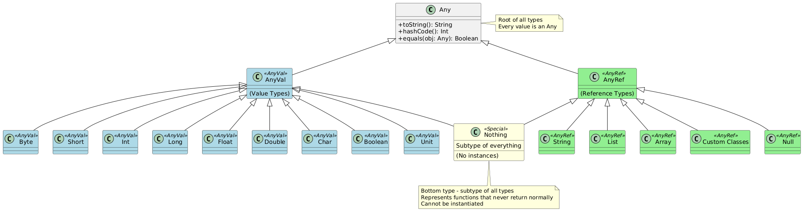

# Day 03: Data Types in Scala

## Table of Contents
1. [Introduction](#introduction)
2. [Core Concepts](#core-concepts)
3. [Code Examples](#code-examples)
4. [Key Takeaways](#key-takeaways)

---

## Introduction

In Day 02, we examined Scala's program structure and syntax conventions. Today, we advance to Scala's type system—the foundation for representing and manipulating data. Understanding data types is essential for writing meaningful programs, as they define what kind of information variables can hold and what operations can be performed on them.

This session introduces Scala's fundamental data types, type hierarchy, and type inference mechanism. We will also explore practical applications including string interpolation and common type-related errors.

---

## Core Concepts

### 1. Fundamental Principle: Everything is an Object

In Scala, **every value is an object**, including what other languages consider "primitive" types. This unified object model distinguishes Scala from Java.

**Practical Implication:**  
You can invoke methods on any value, even numeric literals.

```scala
// In Java, primitives don't have methods
// In Scala, everything is an object with methods

val result1 = 5.toString        // "5"
val result2 = 42.toDouble       // 42.0
val result3 = 3.14.toInt        // 3
val result4 = true.hashCode     // 1231
```

**Why This Matters:**  
This consistency simplifies the language—you don't need separate rules for primitives versus objects. Every value supports a consistent set of operations.

---

### 2. Numeric Types

Scala provides multiple numeric types to represent different ranges and precision levels. Choosing the appropriate type affects memory consumption and computational precision.

#### 2.1 Integer Types

Integer types represent whole numbers without fractional components.

| Type | Size | Range | Purpose |
|------|------|-------|---------|
| `Byte` | 8 bits | -128 to 127 | Very small integers, memory-constrained scenarios |
| `Short` | 16 bits | -32,768 to 32,767 | Small integers |
| `Int` | 32 bits | -2,147,483,648 to 2,147,483,647 | Default integer type (most common) |
| `Long` | 64 bits | -9,223,372,036,854,775,808 to 9,223,372,036,854,775,807 | Large integers |

**Code Examples:**

```scala
val smallNumber: Byte = 100
val mediumNumber: Short = 1000
val regularNumber: Int = 42
val largeNumber: Long = 123456789L  // Note the 'L' suffix

// Default inference
val autoInt = 42        // Scala infers Int (no suffix needed)
val autoLong = 42L      // 'L' suffix explicitly creates Long
```

**Important Rules:**
1. Integer literals without suffix default to `Int`
2. Long literals require `L` or `l` suffix (uppercase `L` preferred for clarity)
3. Exceeding type range causes overflow (wraps around, doesn't error)

#### 2.2 Floating-Point Types

Floating-point types represent numbers with fractional components.

| Type | Size | Precision | Purpose |
|------|------|-----------|---------|
| `Float` | 32 bits | ~6-7 decimal digits | Single-precision decimals |
| `Double` | 64 bits | ~15-16 decimal digits | Double-precision decimals (default) |

**Code Examples:**

```scala
val floatNumber: Float = 3.14f     // 'f' suffix required
val doubleNumber: Double = 3.14    // Default for decimal literals

// Default inference
val autoDouble = 3.14     // Scala infers Double
val autoFloat = 3.14f     // 'f' suffix explicitly creates Float

// Scientific notation
val scientific = 1.23e-4  // 0.000123 (Double)
val scientificFloat = 1.23e-4f  // (Float)
```

**Critical Points:**
1. Decimal literals without suffix default to `Double`
2. Float literals require `f` or `F` suffix
3. `Double` provides higher precision than `Float`
4. For big data applications (Spark), consider memory trade-offs between `Float` and `Double`

---

### 3. Text Types

#### 3.1 Character Type

The `Char` type represents a single Unicode character.

```scala
val letter: Char = 'A'           // Single quotes for Char
val digit: Char = '5'
val symbol: Char = '@'
val unicode: Char = '\u0041'     // Unicode representation of 'A'

// Common mistake - this is String, not Char
// val wrong: Char = "A"         // Error! Double quotes create String
```

**Key Characteristics:**
- Uses single quotes `' '`
- Holds exactly one character
- Based on Java's `char` type (16-bit Unicode)

#### 3.2 String Type

The `String` type represents sequences of characters (text).

```scala
val text: String = "Hello"       // Double quotes for String
val empty: String = ""           // Empty string (valid)
val sentence = "Hello, Scala!"   // Type inference

// Multi-line strings (triple quotes)
val multiLine = """
  Line 1
  Line 2
  Line 3
"""

// Raw strings (ignores escape sequences)
val path = """C:\Users\Documents\file.txt"""
```

**Multi-line String Characteristics:**
- Delimited by triple double-quotes `"""`
- Preserves line breaks and formatting
- Useful for embedded text blocks, SQL queries, JSON templates

---

### 4. Boolean Type

The `Boolean` type represents truth values.

```scala
val isTrue: Boolean = true
val isFalse: Boolean = false

// Boolean expressions
val result = 5 > 3           // true
val comparison = (10 == 20)  // false
val combined = true && false // false (logical AND)
val either = true || false   // true (logical OR)
```

**Possible Values:**  
Only `true` and `false` (lowercase keywords).

---

### 5. Special Types

#### 5.1 Unit Type

`Unit` represents the absence of a meaningful return value, equivalent to Java's `void`.

```scala
def printMessage(): Unit = {
  println("This function returns nothing meaningful")
}

// Unit has exactly one value: ()
val unitValue: Unit = ()
```

**Usage:**  
Functions that perform side effects (printing, writing files, modifying state) but don't return data typically have `Unit` return type.

#### 5.2 Null Type

`Null` represents the absence of a reference value. Its only instance is `null`.

```scala
val absent: String = null   // Valid but discouraged

// Dangerous - leads to NullPointerException
// val length = absent.length  // Runtime error!
```

**Best Practice:**  
Avoid `null` in Scala. Use `Option` types instead (covered in future sessions).

---

### 6. Scala Type Hierarchy

Understanding Scala's type hierarchy is crucial for comprehending type relationships and polymorphism.

```
                        Any
                       /   \
                  AnyVal   AnyRef
                    |         |
        (Value Types)    (Reference Types)
       /    |    |   \         |
    Byte Short Int Long    String, Lists, Classes
      |     |    |   |         |
    Char Float Double         Null
         Boolean
           Unit

                    Nothing
              (Bottom Type)
```

#### 6.1 Any: The Universal Supertype

**`Any`** is the root of Scala's type hierarchy—every type inherits from `Any`.

```scala
val integer: Any = 42
val text: Any = "Hello"
val flag: Any = true
val list: Any = List(1, 2, 3)

// All values are subtypes of Any
```

**Methods Available on Any:**
- `toString`: String representation
- `hashCode`: Integer hash code
- `equals`: Equality comparison
- `##`: Hash code for collections
- `isInstanceOf[T]`: Type checking
- `asInstanceOf[T]`: Type casting

#### 6.2 AnyVal: Value Types

**`AnyVal`** is the supertype of all value types (primitive-like types stored directly).

**Members of AnyVal:**
- Numeric types: `Byte`, `Short`, `Int`, `Long`, `Float`, `Double`
- Character type: `Char`
- Boolean type: `Boolean`
- Unit type: `Unit`

**Characteristics:**
- Stored as immediate values (not heap-allocated objects)
- More memory-efficient than reference types
- Cannot be `null`

```scala
val number: AnyVal = 42
val character: AnyVal = 'A'
val truth: AnyVal = true
```

#### 6.3 AnyRef: Reference Types

**`AnyRef`** is the supertype of all reference types (objects stored on the heap). It corresponds to Java's `Object`.

**Members of AnyRef:**
- `String`
- Collections (`List`, `Array`, `Map`, etc.)
- User-defined classes
- `Null`

**Characteristics:**
- Stored as references (pointers to heap objects)
- Can be `null` (though discouraged)
- Support identity equality (`eq`)

```scala
val text: AnyRef = "Hello"
val list: AnyRef = List(1, 2, 3)
val person: AnyRef = new Person("Alice")
```

#### 6.4 Unit: No-Value Type

**`Unit`** represents the absence of a meaningful value, used as return type for procedures.

```scala
def sideEffect(): Unit = {
  println("Performing action")
  // Implicitly returns ()
}

val result: Unit = ()  // Unit's single value
```

#### 6.5 Null: Null Reference Type

**`Null`** is a subtype of all reference types (`AnyRef`). Its only value is `null`.

```scala
val emptyString: String = null
val emptyList: List[Int] = null

// Null is NOT a subtype of AnyVal
// val nullInt: Int = null  // Compilation error!
```

**Important:**  
`Null` can only be assigned to `AnyRef` types, not `AnyVal` types.

#### 6.6 Nothing: The Bottom Type

**`Nothing`** is a subtype of every type—the bottom of the type hierarchy.

**Key Characteristics:**
1. Has **no instances**—you cannot create a value of type `Nothing`
2. Used for functions that never return normally (throw exceptions, infinite loops)

```scala
// Function that always throws exception
def fail(): Nothing = {
  throw new RuntimeException("Operation failed")
}

// Function with infinite loop
def infiniteLoop(): Nothing = {
  while (true) { }
}

// Nothing can substitute any type
val x: Int = fail()      // Valid (though throws exception)
val y: String = fail()   // Valid (though throws exception)
```

**Why Nothing Exists:**  
It allows type-safe representation of abnormal termination while maintaining type system consistency.

---

### 7. Type Hierarchy Diagram



---

### 8. Type Inference

Type inference allows the Scala compiler to automatically deduce types, reducing verbosity while maintaining type safety.

#### 8.1 Basic Type Inference

```scala
// Compiler infers types automatically
val number = 42              // Inferred as Int
val decimal = 3.14           // Inferred as Double
val text = "Hello"           // Inferred as String
val flag = true              // Inferred as Boolean
val items = List(1, 2, 3)    // Inferred as List[Int]

// Equivalent explicit declarations
val number: Int = 42
val decimal: Double = 3.14
val text: String = "Hello"
val flag: Boolean = true
val items: List[Int] = List(1, 2, 3)
```

**Inference Rules:**
- Whole number literals → `Int`
- Decimal literals → `Double`
- String literals → `String`
- Boolean literals → `Boolean`

#### 8.2 When to Use Explicit Types

While type inference is powerful, explicit type annotations improve code clarity in certain scenarios:

1. **Public API boundaries** (method parameters and return types)
2. **Complex expressions** where inferred type isn't obvious
3. **Recursive functions** (return type must be explicit)
4. **Overriding methods** (for clarity)

```scala
// Explicit types recommended for public methods
def calculateTotal(price: Double, quantity: Int): Double = {
  price * quantity
}

// Explicit type needed for recursion
def factorial(n: Int): Int = {
  if (n <= 1) 1
  else n * factorial(n - 1)
}
```

#### 8.3 When Inference Fails

```scala
// Ambiguous - compiler cannot infer
// val ambiguous = 42.toString + 10  // Error! String + Int unclear

// Solution: explicit type annotation
val fixed: String = 42.toString + "10"  // "4210"

// Or make operation unambiguous
val fixed2 = 42.toString + 10.toString  // "4210"
```

---

### 9. String Interpolation

String interpolation enables embedding expressions directly within string literals.

#### 9.1 s-Interpolator (Basic)

Prefix string with `s` and use `$` to embed variables or `${}` for expressions.

```scala
val name = "Alice"
val age = 30

// Variable interpolation
val greeting = s"Hello, $name!"
println(greeting)  // Hello, Alice!

// Expression interpolation
val message = s"$name is $age years old"
println(message)   // Alice is 30 years old

// Complex expressions require braces
val calculation = s"Next year, $name will be ${age + 1}"
println(calculation)  // Next year, Alice will be 31
```

#### 9.2 f-Interpolator (Formatted)

Provides printf-style formatting.

```scala
val pi = 3.14159265

// Format to 2 decimal places
println(f"Pi ≈ $pi%.2f")  // Pi ≈ 3.14

// Format with width and precision
val price = 19.99
println(f"Price: $price%8.2f")  // Price:    19.99 (8 characters wide)

// Integer formatting
val count = 42
println(f"Count: $count%05d")  // Count: 00042 (5 digits, zero-padded)
```

**Format Specifiers:**
- `%d` - Integer
- `%f` - Floating-point
- `%s` - String
- `%.2f` - 2 decimal places
- `%8.2f` - 8 characters wide, 2 decimal places

#### 9.3 raw-Interpolator

Disables escape sequence processing.

```scala
// Normal string - escape sequences processed
val normal = "C:\\Users\\Documents"
println(normal)  // C:\Users\Documents

// Raw string - escape sequences NOT processed
val raw = raw"C:\\Users\\Documents"
println(raw)     // C:\\Users\\Documents (backslashes printed literally)

// Useful for regex patterns
val pattern = raw"\d{3}-\d{3}-\d{4}"  // Phone number pattern
```

---

### 10. Common Type-Related Pitfalls

#### 10.1 Forgetting Type Suffixes

```scala
// Wrong - defaults to Double (higher precision, more memory)
val imprecise = 3.14

// Correct for Float requirements
val precise: Float = 3.14f
```

#### 10.2 Integer Overflow

Exceeding type range causes wraparound, not error.

```scala
val maxByte: Byte = 127
val overflow = (maxByte + 1).toByte  // Result: -128 (wraps around!)

// Solution: use larger type
val correct: Short = (maxByte + 1).toShort  // 128
```

#### 10.3 Null Pointer Dangers

```scala
val risky: String = null

// Runtime error - NullPointerException
// println(risky.length)

// Safe alternative (to be covered in Option types)
if (risky != null) {
  println(risky.length)
}
```

#### 10.4 String vs Char Confusion

```scala
val char: Char = 'A'       // Single quotes - Char
val string: String = "A"   // Double quotes - String

// Error - type mismatch
// val wrong: Char = "A"
```

---

## Code Examples

### Example 1: Type Demonstrations
```scala
object TypeDemo {
  def main(args: Array[String]): Unit = {
    // Numeric types
    val byte: Byte = 100
    val short: Short = 1000
    val int: Int = 42
    val long: Long = 123456789L
    val float: Float = 3.14f
    val double: Double = 3.14
    
    // Text types
    val char: Char = 'A'
    val string: String = "Hello"
    
    // Boolean
    val bool: Boolean = true
    
    // Special types
    val unit: Unit = ()
    
    // Print with types
    println(s"byte: $byte (${byte.getClass.getSimpleName})")
    println(s"int: $int (${int.getClass.getSimpleName})")
    println(s"string: $string (${string.getClass.getSimpleName})")
  }
}
```

### Example 2: String Interpolation
```scala
object InterpolationDemo {
  def main(args: Array[String]): Unit = {
    val name = "Bob"
    val age = 25
    val height = 5.9
    
    // s-interpolator
    println(s"Name: $name")
    println(s"In 5 years: ${age + 5} years old")
    
    // f-interpolator
    println(f"Height: $height%.1f feet")
    println(f"Age: $age%03d")
    
    // raw-interpolator
    val path = raw"C:\Users\Documents\file.txt"
    println(s"Path: $path")
  }
}
```

### Example 3: Type Hierarchy
```scala
object HierarchyDemo {
  def main(args: Array[String]): Unit = {
    // Everything is Any
    val values: List[Any] = List(42, "hello", true, 3.14)
    
    values.foreach(v => println(s"$v is an Any"))
    
    // AnyVal examples
    val number: AnyVal = 42
    val flag: AnyVal = true
    
    // AnyRef examples
    val text: AnyRef = "Hello"
    val list: AnyRef = List(1, 2, 3)
    
    println(s"number is AnyVal: ${number.isInstanceOf[AnyVal]}")
    println(s"text is AnyRef: ${text.isInstanceOf[AnyRef]}")
  }
}
```

---

## Key Takeaways

### Core Principles
1. **Everything is an object** - Even numbers have methods (`5.toString`)
2. **Type hierarchy** - All types descend from `Any`; `Nothing` is subtype of all types
3. **Value vs Reference** - `AnyVal` (primitives), `AnyRef` (objects)

### Numeric Types
4. **Integer defaults** - Literals default to `Int`, use `L` suffix for `Long`
5. **Decimal defaults** - Literals default to `Double`, use `f` suffix for `Float`
6. **Type ranges** - Choose appropriate type to avoid overflow

### Text Types
7. **Char vs String** - Single quotes for `Char`, double quotes for `String`
8. **Multi-line strings** - Triple quotes `"""` preserve formatting

### Special Types
9. **Unit** - Like `void`, represents no meaningful value
10. **Null** - Avoid when possible, use `Option` instead
11. **Nothing** - Bottom type, represents functions that never return normally

### Type Inference
12. **Automatic inference** - Compiler deduces types from context
13. **Explicit when needed** - Public APIs, recursion, complex expressions
14. **Type safety** - Errors caught at compile-time, not runtime

### String Interpolation
15. **s-interpolator** - Basic variable/expression embedding
16. **f-interpolator** - Printf-style formatting
17. **raw-interpolator** - Disables escape sequence processing

### Common Pitfalls
18. **Type suffixes** - Remember `L` for Long, `f` for Float
19. **Integer overflow** - Values wrap around, not error
20. **Null dangers** - Leads to `NullPointerException`

---

## Conclusion

This session established comprehensive understanding of Scala's type system. You now know the available data types, their hierarchy relationships, type inference mechanics, and practical string interpolation techniques. These concepts form the foundation for variable declarations and data manipulation covered in subsequent sessions.

The unified object model—where everything is an object—simplifies Scala's conceptual framework while maintaining performance through intelligent compilation strategies.


---

*Document Version: 1.0*  
*Last Updated: Day 03 of Scala Learning Journey*