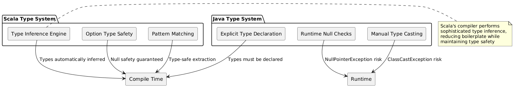
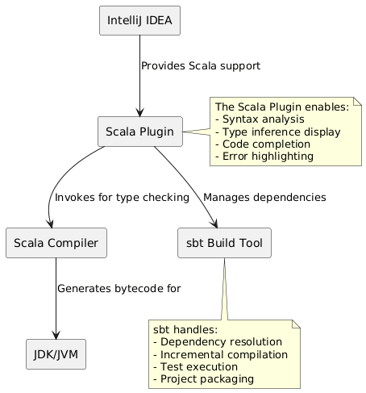

# Day 01: Introduction to Scala and Development Environment Setup

## Table of Contents
1. [Introduction](#introduction)
2. [Core Concepts](#core-concepts)
3. [Development Environment](#development-environment)
4. [Key Takeaways](#key-takeaways)

---

## Introduction

This document serves as a comprehensive introduction to the Scala programming language, its fundamental characteristics, and the essential development environment required to begin Scala programming. As students with a foundational understanding of Java, you will find several familiar concepts, alongside powerful new paradigms that distinguish Scala as a modern, scalable language.

Scala represents a significant evolution in JVM-based languages, combining the robust object-oriented principles familiar from Java with functional programming paradigms that enable more concise, maintainable, and error-resistant code.

---

## Core Concepts

### 1.1 Understanding Scala: Definition and Origin

**Scala** is a portmanteau derived from "**SCALAble language**," reflecting its design philosophy of scaling from small scripts to large enterprise systems.

**Historical Context:**
- **Year of Creation:** 2004
- **Creator:** Martin Odersky, a computer scientist at École Polytechnique Fédérale de Lausanne (EPFL)
- **Execution Platform:** Java Virtual Machine (JVM)
- **Paradigm:** Hybrid (Object-Oriented + Functional Programming)

**Formal Definition:**  
Scala is a statically-typed, general-purpose programming language that seamlessly integrates object-oriented and functional programming paradigms while maintaining full interoperability with Java. It executes on the JVM, enabling developers to leverage existing Java libraries and frameworks while writing more expressive and concise code.

**Analogy for Java Developers:**  
Consider Scala as an enhanced version of Java—retaining Java's execution model and library ecosystem while introducing advanced type inference, immutability-first design, pattern matching, and higher-order functions. The result is reduced boilerplate code with increased type safety.

---

### 1.2 Advantages of Scala

#### 1.2.1 Code Conciseness
Scala's advanced language features—including type inference, case classes, and functional constructs—enable developers to express complex logic in significantly fewer lines of code. Empirical studies suggest that Scala programs are typically **2-3 times shorter** than equivalent Java implementations.

**Example:**
```scala
// Java approach
public class Person {
    private final String name;
    private final int age;
    
    public Person(String name, int age) {
        this.name = name;
        this.age = age;
    }
    
    public String getName() { return name; }
    public int getAge() { return age; }
    
    @Override
    public boolean equals(Object o) { /* 10+ lines */ }
    @Override
    public int hashCode() { /* 5+ lines */ }
    @Override
    public String toString() { /* 3+ lines */ }
}

// Scala equivalent
case class Person(name: String, age: Int)
```

#### 1.2.2 Enhanced Type Safety
Scala's sophisticated type system detects errors at compile-time that would manifest as runtime exceptions in Java. The compiler performs advanced type inference, catching type mismatches, null pointer risks, and logical inconsistencies before code execution.

#### 1.2.3 Functional Programming Capabilities
Scala treats functions as first-class citizens, enabling:
- **Higher-order functions:** Functions that accept other functions as parameters
- **Immutability by default:** Reducing side effects and race conditions
- **Pattern matching:** Elegant handling of complex conditional logic
- **Function composition:** Building complex operations from simple, reusable functions

#### 1.2.4 Complete Java Interoperability
Scala compiles to JVM bytecode, ensuring:
- Seamless integration with existing Java libraries
- The ability to call Java methods from Scala and vice versa
- Access to the vast Java ecosystem (Spring, Hibernate, Apache Commons, etc.)
- No performance penalty compared to native Java code

#### 1.2.5 Big Data Ecosystem Integration
Apache Spark, the industry-standard distributed computing framework, is implemented in Scala. Consequently, Scala provides:
- Native Spark API with full feature access
- Superior performance in Spark applications
- Idiomatic support for distributed data processing patterns

#### 1.2.6 Modern Language Features
Scala incorporates contemporary programming constructs:
- **Pattern matching:** Sophisticated conditional branching
- **Traits:** Flexible composition mechanism (superior to Java interfaces)
- **Case classes:** Automatic implementation of common methods
- **Implicit parameters and conversions:** Extensibility without modification
- **For-comprehensions:** Elegant iteration and transformation syntax

---

### 1.3 Comparative Analysis: Scala vs. Java

The following table delineates key differentiators between Scala and Java:

| **Characteristic**        | **Java**                                    | **Scala**                                  |
|---------------------------|---------------------------------------------|--------------------------------------------|
| **Type Declarations**     | Explicit and verbose (must declare types)   | Type inference (compiler infers types)     |
| **Code Volume**           | High verbosity, repetitive boilerplate      | Concise, expressive syntax                 |
| **Null Safety**           | Prone to `NullPointerException`             | `Option` types eliminate null references   |
| **Functional Support**    | Limited (lambdas introduced in Java 8)      | First-class functional programming         |
| **Immutability**          | Manual implementation required              | Built-in immutable collections             |
| **Learning Curve**        | Gentler for programming novices             | Steeper due to paradigm diversity          |
| **Concurrency**           | Synchronized blocks, complex thread mgmt    | Akka actors, Futures, immutable state      |

**Architectural Diagram: Java vs Scala Type Systems**



---

### 1.4 Real-World Applications of Scala

Scala has achieved widespread adoption across multiple domains:

#### 1.4.1 Big Data and Distributed Computing
- **Apache Spark:** The de facto standard for large-scale data processing
- **Apache Kafka Streams:** Stream processing applications
- **Apache Flink:** Real-time data streaming (partial Scala support)

*Rationale:* Spark's core is written in Scala, providing native integration and optimal performance.

#### 1.4.2 Web Development
- **Play Framework:** High-velocity web framework (reactive, asynchronous)
- **Akka HTTP:** Toolkit for building HTTP-based services
- **Scalatra:** Lightweight web microframework

#### 1.4.3 Financial Technology
- **High-Frequency Trading Systems:** Low-latency, concurrent processing
- **Risk Analysis Platforms:** Complex mathematical computations
- **Banking Infrastructure:** Morgan Stanley, Goldman Sachs

#### 1.4.4 Machine Learning
- **MLlib:** Spark's machine learning library
- **DeepLearning4J:** Scala API for deep learning
- **Breeze:** Numerical processing library

#### 1.4.5 Enterprise Adoption
**Organizations utilizing Scala:**
- **Twitter:** Core infrastructure and services
- **Netflix:** Content delivery and recommendation systems
- **LinkedIn:** Data processing pipelines
- **Apple:** Internal services and analytics
- **Airbnb:** Search infrastructure
- **Spotify:** Backend services and data analysis

**Critical Insight:**  
Scala's dominance in Apache Spark means that mastering Scala is essentially prerequisite for advanced big data engineering roles. Since Spark exposes its most comprehensive API in Scala, performance-critical applications and advanced features are best accessed through Scala implementations.

---

## Development Environment

Establishing a proper development environment is foundational to productive Scala programming. This section elucidates the purpose and function of each essential component.

### 2.1 Java Development Kit (JDK)

**Purpose:**  
The JDK provides the Java Virtual Machine (JVM), which serves as the execution runtime for Scala programs. Since Scala compiles to JVM bytecode, the JDK is an absolute prerequisite.

**Technical Rationale:**  
Scala does not have its own independent runtime. Instead, it leverages the mature, highly-optimized JVM infrastructure. This design decision grants Scala:
- Cross-platform compatibility
- Enterprise-grade performance
- Access to Java's extensive library ecosystem
- Mature garbage collection and memory management

**Installation Consideration:**  
Ensure JDK version compatibility with your Scala version. Modern Scala (2.13+, 3.x) requires JDK 8 or higher, with JDK 11 or 17 recommended for production systems.

---

### 2.2 Scala Compiler Installation (via Coursier or Direct Install)

**Purpose:**  
The Scala compiler (`scalac`) translates Scala source code into JVM bytecode. Installing Scala makes the compiler available system-wide.

**Technical Details:**
- **Coursier:** A dependency resolver and artifact manager for Scala, simplifying installation and version management
- **Direct Install:** Traditional installation via binary distributions

**System Integration:**  
Post-installation, the system's PATH environment variable includes the Scala binaries, enabling command-line invocation of `scala` (REPL) and `scalac` (compiler).

---

### 2.3 IntelliJ IDEA with Scala Plugin

**Purpose:**  
IntelliJ IDEA serves as the Integrated Development Environment (IDE), while the Scala Plugin provides language-specific intelligence.

**Capabilities:**
- **Syntax Highlighting:** Visual distinction of language constructs
- **Code Completion:** Context-aware suggestions for methods, types, and variables
- **Error Detection:** Real-time identification of syntax and type errors
- **Refactoring Tools:** Safe code restructuring (rename, extract method, etc.)
- **Debugger Integration:** Step-through debugging with variable inspection
- **Build Tool Integration:** Seamless sbt project management

**Analogy:**  
If programming is analogous to piloting an aircraft, IntelliJ IDEA with the Scala Plugin is the cockpit's instrument panel—providing essential feedback, navigation assistance, and control mechanisms for efficient development.

**Architecture Diagram: IDE Integration**



---

### 2.4 sbt (Simple Build Tool)

**Purpose:**  
sbt is Scala's de facto build automation tool, analogous to Maven or Gradle in the Java ecosystem.

**Core Responsibilities:**

1. **Dependency Management:**  
   Automatically downloads and manages external libraries specified in the build configuration, resolving transitive dependencies.

2. **Incremental Compilation:**  
   Recompiles only modified source files and their dependencies, significantly reducing build times.

3. **Test Execution:**  
   Integrates with testing frameworks (ScalaTest, Specs2) to execute test suites.

4. **Project Packaging:**  
   Generates deployable artifacts (JAR files, Docker images) for production deployment.

5. **Multi-Module Projects:**  
   Manages complex projects with multiple sub-modules and inter-module dependencies.

**Industry Standard:**  
sbt is ubiquitous in professional Scala development. Mastery of sbt configuration and usage is essential for collaborative projects and open-source contributions.

**Conceptual Model:**  
Think of sbt as the project manager who orchestrates all tedious, repetitive tasks—library procurement, compilation sequencing, test orchestration, and artifact generation—freeing developers to focus on business logic implementation.

---

### 2.5 Scala REPL (Read-Eval-Print Loop)

**Purpose:**  
The REPL provides an interactive environment for executing Scala expressions and observing immediate results.

**Workflow:**
1. **Read:** Accepts a line of Scala code as input
2. **Eval:** Compiles and executes the code
3. **Print:** Displays the result or any errors
4. **Loop:** Returns to accept the next input

**Pedagogical Value:**  
The REPL is invaluable for:
- **Concept Exploration:** Testing language features without project overhead
- **Rapid Prototyping:** Experimenting with algorithms and data transformations
- **Debugging:** Isolating and testing specific code fragments
- **Learning:** Immediate feedback reinforces understanding

**Example REPL Session:**
```scala
scala> val x = 42
val x: Int = 42

scala> val doubled = x * 2
val doubled: Int = 84

scala> def greet(name: String) = s"Hello, $name!"
def greet(name: String): String

scala> greet("Scala")
val res0: String = Hello, Scala!
```

**Analogy:**  
The REPL is analogous to a laboratory workbench where scientists conduct isolated experiments to understand phenomena before integrating findings into larger systems.

---

## Key Takeaways

### Conceptual Understanding
1. **Scala is a hybrid language:** It unifies object-oriented and functional paradigms on the JVM, offering Java interoperability with enhanced expressiveness.

2. **Code efficiency:** Scala programs are significantly more concise than Java equivalents while maintaining or enhancing type safety.

3. **Null safety:** The `Option` type eliminates `NullPointerException` risks by encoding the possibility of absence directly in the type system.

4. **Big Data synergy:** Scala's intimate relationship with Apache Spark makes it the preferred language for distributed data processing.

### Technical Foundations
5. **JDK dependency:** Scala requires the JVM provided by the JDK—it does not have an independent runtime.

6. **Toolchain components:** Professional Scala development requires:
   - **JDK:** Execution environment
   - **Scala compiler:** Source-to-bytecode translation
   - **IntelliJ IDEA + Plugin:** Development environment with language intelligence
   - **sbt:** Build automation and dependency management
   - **REPL:** Interactive experimentation platform

### Professional Context
7. **Industry adoption:** Major technology companies (Twitter, Netflix, LinkedIn) rely on Scala for critical infrastructure.

8. **Learning investment:** While Scala presents a steeper learning curve than Java, the productivity gains and advanced capabilities justify the initial effort.

9. **Career relevance:** Scala expertise is highly valued in big data engineering, distributed systems, and financial technology domains.

---

## Conclusion

This foundational session established the rationale for Scala adoption, its comparative advantages over Java, real-world applications, and the essential development environment. Subsequent sessions will delve into Scala's syntax, type system, functional constructs, and practical programming patterns.

The journey from Java to Scala involves not merely learning new syntax, but adopting new ways of thinking about program structure, data transformation, and error handling. Embrace the challenge—the rewards in code quality, maintainability, and career opportunities are substantial.

---

*Document Version: 1.0*  
*Last Updated: Day 01 of Scala Learning Journey*