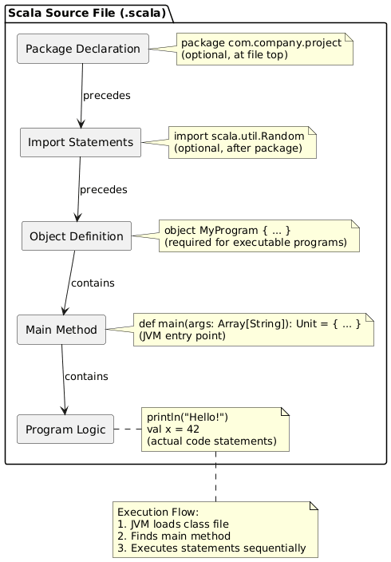

# Day 02: Scala Syntax Basics

## Table of Contents
1. [Introduction](#introduction)
2. [Core Concepts](#core-concepts)
3. [Code Examples](#code-examples)
4. [Key Takeaways](#key-takeaways)

---

## Introduction

In Day 01, we established foundational knowledge about Scala's purpose and development environment. Today, we transition to practical programming by examining Scala's fundamental syntax. This session focuses on program structure, naming conventions, and special character handling—essential prerequisites for writing executable Scala code.

As students familiar with Java, you will notice both similarities and departures from Java's syntax. This document emphasizes the conceptual understanding of each syntactic element before introducing implementation details.

---

## Core Concepts

### 1. Program Structure: The Building Blocks

Every Scala program requires a specific organizational structure to execute successfully. Understanding this structure is analogous to understanding the anatomy of a building before constructing one.

#### 1.1 The Basic Template

```scala
object MyProgram {
  def main(args: Array[String]): Unit = {
    println("Hello Scala!")
  }
}
```

This represents the minimal structure required for an executable Scala program. Let us dissect each component systematically.

---

#### 1.2 Component Analysis

##### **1.2.1 The `object` Declaration**

```scala
object MyProgram {
  // code goes here
}
```

**Purpose:**  
The `object` keyword creates a **singleton object**—a container that holds your program's code and exists as a single instance throughout program execution.

**Conceptual Comparison to Java:**  
In Java, you would write:
```java
public class MyProgram {
    // code here
}
```

However, Scala's `object` differs fundamentally: it creates both a class definition *and* its single instance simultaneously. You cannot create multiple instances of an object—it exists uniquely.

**Why Use Objects for Programs?**  
The JVM requires a static entry point to begin execution. In Java, you use `public static void main`. In Scala, placing `main` inside an `object` achieves the same effect because object members are inherently static.

**Naming Convention:**  
Object names follow the same rules as Java class names: begin with an uppercase letter, use CamelCase for multi-word names (e.g., `MyFirstProgram`, `DataProcessor`).

---

##### **1.2.2 The `main` Method**

```scala
def main(args: Array[String]): Unit = {
  // program logic here
}
```

**Breakdown of Components:**

1. **`def`** — The keyword that declares a method (function) definition.
   - Think of `def` as saying "I am defining a method."
   - Equivalent to Java's method declaration syntax.

2. **`main`** — The method name.
   - This specific name is required by the JVM.
   - The JVM searches for a method named `main` when starting program execution.

3. **`args: Array[String]`** — The parameter list.
   - **Format:** `parameterName: ParameterType`
   - `args` is the parameter name (you can use any name, but `args` is conventional)
   - `Array[String]` is the type: an array containing String elements
   - This represents command-line arguments passed to the program when executed

4. **`: Unit`** — The return type declaration.
   - The colon `:` precedes type declarations in Scala
   - `Unit` is Scala's equivalent to Java's `void`
   - It signifies "this method returns nothing meaningful"

5. **`= {`** — Method body delimiter.
   - The equals sign `=` indicates "the method's implementation follows"
   - The curly brace `{` begins the method body

**Comparison to Java:**
```java
// Java
public static void main(String[] args) {
    System.out.println("Hello Java!");
}
```

```scala
// Scala
def main(args: Array[String]): Unit = {
  println("Hello Scala!")
}
```

**Key Differences:**
- No `public static` modifiers needed (object members are implicitly static)
- Type annotations come *after* parameter names (`: Type` syntax)
- Return type comes after parameters (`: Unit`)
- Equals sign `=` before method body

---

##### **1.2.3 The `println` Statement**

```scala
println("Hello Scala!")
```

**Purpose:**  
Outputs text to the console (standard output).

**Syntax Observations:**
1. No semicolon required at line end (Scala infers statement boundaries)
2. String literals enclosed in double quotes
3. Parentheses contain the data to print

**Comparison to Java:**
```java
System.out.println("Hello Java!");  // Requires System.out prefix
```

```scala
println("Hello Scala!")  // Direct function call
```

Scala simplifies console output by providing `println` as a directly accessible function, eliminating the verbose `System.out` prefix.

---

#### 1.3 Optional Structural Elements

##### **1.3.1 Package Declarations**

```scala
package com.mycompany.project

object MyProgram {
  def main(args: Array[String]): Unit = {
    println("Hello Scala!")
  }
}
```

**Purpose:**  
Packages organize related code into hierarchical namespaces, preventing naming conflicts and improving project structure.

**Placement:**  
Package declarations must appear as the first non-comment line in a source file.

**Naming Convention:**  
Use lowercase, dot-separated identifiers following reverse domain name convention (e.g., `com.company.project.module`).

**Java Equivalence:**
Identical to Java's package system—both compile to the same JVM bytecode structure.

---

##### **1.3.2 Import Statements**

```scala
import scala.util.Random
import scala.collection.mutable.ArrayBuffer

object MyProgram {
  def main(args: Array[String]): Unit = {
    val randomNumber = Random.nextInt(100)
    println(s"Random number: $randomNumber")
  }
}
```

**Purpose:**  
Import statements make external classes, objects, and functions available in the current scope without requiring fully-qualified names.

**Syntax:**
- `import packageName.ClassName` — Imports a specific class
- `import packageName._` — Imports all members from a package (underscore `_` is Scala's wildcard, equivalent to Java's `*`)

**Placement:**  
Import statements appear after package declarations and before object/class definitions.

**Common Imports:**
- `scala.util.Random` — Random number generation
- `scala.collection.mutable._` — Mutable collections
- `scala.io.Source` — File I/O operations

---

### 2. Comments: Documenting Code

Comments enable inline documentation, explaining code purpose and logic to human readers while being ignored by the compiler.

#### 2.1 Single-Line Comments

```scala
// This is a single-line comment
val x = 42  // Comments can appear at line end
```

**Syntax:**  
Begin with double forward slash `//`. Everything following on that line is treated as a comment.

#### 2.2 Multi-Line Comments

```scala
/*
This is a multi-line comment.
It can span multiple lines.
Useful for detailed explanations or temporarily disabling code blocks.
*/
val y = 100
```

**Syntax:**  
Begin with `/*` and end with `*/`. All text between these delimiters is treated as a comment, regardless of line breaks.

**Best Practice:**  
Use single-line comments for brief explanations. Reserve multi-line comments for substantial documentation or temporarily disabling large code sections during debugging.

---

### 3. Identifiers: Naming Your Code Elements

#### 3.1 Definition

**Identifiers** are programmer-defined names assigned to code elements—variables, methods, classes, objects, and packages.

**Conceptual Analogy:**  
Just as you assign names to files in a file system for later retrieval, identifiers allow you to reference code elements by name.

#### 3.2 Naming Rules

Scala enforces specific rules for valid identifiers:

1. **Alphanumeric Identifiers:**
   - Must begin with a letter (a-z, A-Z) or underscore `_`
   - Subsequent characters can be letters, digits (0-9), or underscores
   - Examples: `myVariable`, `result2`, `_privateField`

2. **Operator Identifiers:**
   - Consist of one or more operator characters: `+`, `-`, `*`, `/`, `!`, `@`, `#`, etc.
   - Examples: `+`, `::`, `-->` (used in DSLs and symbolic methods)

3. **Backtick Identifiers:**
   - Any string enclosed in backticks `` ` ``
   - Allows reserved keywords or special characters as identifiers
   - Example: `` `class` ``, `` `My Variable` ``

4. **Unicode Identifiers:**
   - Scala supports Unicode characters in identifiers
   - Example: `π = 3.14159`, `λ = (x: Int) => x * 2`

#### 3.3 Examples with Explanations

```scala
// Standard alphanumeric identifiers (preferred style)
val userName = "Alice"          // camelCase - starts lowercase, capitals for word boundaries
val MaxConnections = 100        // PascalCase - starts uppercase (used for constants/classes)

// Underscore usage
val _privateValue = 42          // Leading underscore suggests private/internal use
val result_final = true         // snake_case - underscores separate words (valid but uncommon in Scala)

// Backtick identifiers (for special cases)
val `my variable` = 10          // Spaces allowed within backticks
val `class` = "reserved word"   // Using reserved keyword as identifier

```

**Naming Conventions (Best Practices):**
- **Variables/methods:** camelCase (`myVariable`, `calculateTotal`)
- **Classes/objects:** PascalCase (`UserAccount`, `DataProcessor`)
- **Constants:** PascalCase or UPPER_SNAKE_CASE (`MaxRetries`, `DEFAULT_TIMEOUT`)
- **Packages:** lowercase, dot-separated (`com.mycompany.utils`)

---

### 4. Keywords: Reserved Language Terms

#### 4.1 Definition

**Keywords** are reserved words with predefined meanings in the Scala language. They cannot be used as identifiers because the compiler interprets them as language constructs.

**Analogy:**  
Keywords are like "command words" in natural language—they have fixed meanings that cannot be redefined. You cannot name your pet "The" because "the" already has a grammatical function.

#### 4.2 Common Scala Keywords

```scala
// Declaration keywords
class      // Define a class
object     // Define a singleton object
trait      // Define a trait (similar to Java interface)
def        // Define a method
val        // Define an immutable variable
var        // Define a mutable variable

// Control flow keywords
if         // Conditional branching
else       // Alternative branch
for        // Loop iteration
while      // Conditional loop
do         // Do-while loop
match      // Pattern matching

// Organizational keywords
package    // Package declaration
import     // Import external code
extends    // Inheritance
with       // Mixin composition

// Special keywords
return     // Early return from method
yield      // Generate values in comprehensions
new        // Object instantiation
this       // Current object reference
super      // Parent class reference
```

#### 4.3 Why Keywords Cannot Be Identifiers

```scala
// ❌ INVALID - Attempting to use keywords as identifiers
val class = "hello"       // Compiler error: 'class' is a keyword
val def = 42              // Compiler error: 'def' is a keyword
val if = true             // Compiler error: 'if' is a keyword
```

**Reason:**  
The compiler's parser interprets keywords as structural directives. Allowing them as identifiers would create ambiguity, making code unparseable.

**Workaround (if absolutely necessary):**
```scala
// ✅ VALID - Backticks allow keyword usage as identifiers
val `class` = "hello"     // Acceptable, though discouraged
```

---

### 5. Escape Sequences: Special Characters in Strings

#### 5.1 Definition

**Escape sequences** are character combinations that represent special characters within string literals. They begin with a backslash `\` followed by a character code.

**Purpose:**  
Certain characters have special meanings in strings (e.g., quotes delimit string boundaries). Escape sequences allow their literal inclusion within strings.

#### 5.2 Common Escape Sequences

| Escape Sequence | Meaning | Visual Effect |
|-----------------|---------|---------------|
| `\n` | Newline | Moves cursor to next line |
| `\t` | Tab | Inserts horizontal tab spacing |
| `\"` | Double quote | Inserts literal `"` character |
| `\'` | Single quote | Inserts literal `'` character |
| `\\` | Backslash | Inserts literal `\` character |
| `\r` | Carriage return | Returns cursor to line beginning |
| `\b` | Backspace | Moves cursor one position back |

#### 5.3 Practical Examples

```scala
// Example 1: Newline character

val multiLine = "Line 1\nLine 2\nLine 3"
println(multiLine)

Output:
Line 1
Line 2
Line 3

```
```scala
// Example 2: Tab character

val tabbed = "Name\tAge\tCity"
println(tabbed)

Output:
Name    Age    City

```
```scala
// Example 3: Quotes within strings

val dialogue = "She said \"Hello!\" to me"
println(dialogue)

Output:
She said "Hello!" to me

```

#### 5.4 Why Escape Sequences Are Necessary

**Problem Without Escape Sequences:**
```scala
// ❌ INVALID - Quotes conflict with string delimiters
val sentence = "She said "Hello" to me"  // Compiler error
```

The compiler interprets the second `"` as the string's end, causing parsing failure.

**Solution With Escape Sequences:**
```scala
// ✅ VALID - Escaped quotes treated as literal characters
val sentence = "She said \"Hello\" to me"  // Correct
```

The `\"` sequence signals "insert a literal quote character here" rather than "end the string."

---

### 6. Conceptual Diagram: Program Structure

The following diagram illustrates the hierarchical relationship between Scala program components:



---

## Code Examples

### Example 1: Minimal Program
```scala
object HelloWorld {
  def main(args: Array[String]): Unit = {
    println("Hello, Scala!")
  }
}
```

**Explanation:**
- `object HelloWorld` creates the program container
- `def main` defines the entry point
- `println` outputs text to console
- No semicolon required

---

### Example 2: Program with Package and Imports
```scala
package com.learning.scala

import scala.util.Random

object RandomExample {
  def main(args: Array[String]): Unit = {
    val randomValue = Random.nextInt(100)
    println("Random number: " + randomValue)
  }
}
```

**Explanation:**
- Package organizes code into `com.learning.scala` namespace
- Import makes `Random` class available
- `Random.nextInt(100)` generates random number between 0-99
- String concatenation using `+` operator

---

### Example 3: Using Escape Sequences
```scala
object EscapeDemo {
  def main(args: Array[String]): Unit = {
    val message = "Name:\t\"John Doe\"\nAge:\t30\nQuote:\t\"To be or not to be\""
    println(message)
  }
}
```

**Output:**
```
Name:    "John Doe"
Age:    30
Quote:    "To be or not to be"
```

**Explanation:**
- `\t` creates tab spacing for alignment
- `\"` inserts literal quotes within string
- `\n` creates line breaks for readability

---

### Example 4: Valid and Invalid Identifiers
```scala
object IdentifierExamples {
  def main(args: Array[String]): Unit = {
    // ✅ Valid identifiers
    val userName = "Alice"
    val age2 = 25
    val _privateData = "secret"
    val `special name` = 100
    
    // ❌ Invalid identifiers (these would cause errors)
    // val 2age = 25           // Cannot start with digit
    // val user-name = "Bob"   // Hyphen not allowed (unless backticked)
    // val class = "test"      // Keyword cannot be identifier
    
    println(userName)
    println(`special name`)
  }
}
```

---

## Key Takeaways

### Program Structure
1. **Minimal structure:** `object` + `main` method required for executable programs
2. **Object declaration:** `object Name { ... }` creates singleton container
3. **Main method signature:** `def main(args: Array[String]): Unit = { ... }`
4. **Entry point:** JVM searches for `main` method to begin execution

### Syntax Conventions
5. **No semicolons:** Line breaks indicate statement boundaries (semicolons optional)
6. **Type annotations:** Types follow names with colon (`: Type`)
7. **Method bodies:** Equals sign `=` precedes implementation block

### Organizational Elements
8. **Packages:** Organize code, prevent naming conflicts, must be first line
9. **Imports:** Make external code available, appear after packages
10. **Comments:** `//` for single-line, `/* */` for multi-line

### Naming
11. **Identifiers:** Programmer-defined names (variables, methods, classes)
12. **Keywords:** Reserved words with fixed meanings, cannot be identifiers
13. **Naming conventions:** camelCase for variables/methods, PascalCase for classes/objects

### Special Characters
14. **Escape sequences:** `\n` (newline), `\t` (tab), `\"` (quote), `\\` (backslash)
15. **Purpose:** Include special characters literally within strings
16. **Necessity:** Prevent conflicts with string delimiters and control characters

---

## Conclusion

Today's session established the fundamental syntactic framework for Scala programming. You now understand program structure, naming conventions, and string formatting essentials. These foundations enable you to write, compile, and execute basic Scala programs.


---

*Document Version: 1.0*  
*Last Updated: Day 02 of Scala Learning Journey*