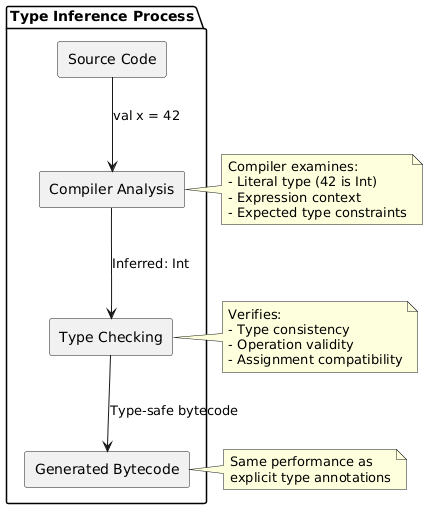
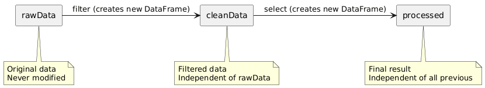

# Day 04: Variables and Type Inference

## Table of Contents
1. [Introduction](#introduction)
2. [Core Concepts](#core-concepts)
3. [Code Examples](#code-examples)
4. [Key Takeaways](#key-takeaways)

---

## Introduction

In Day 03, we explored Scala's type system and the various data types available. Today, we examine how to declare and use variables to store data. This session introduces the fundamental distinction between immutable and mutable variables, explores Scala's type inference capabilities, and establishes naming conventions for professional code.

Understanding when to use immutable versus mutable variables is critical for writing safe, maintainable Scala code—particularly in distributed computing environments like Apache Spark.

---

## Core Concepts

### 1. Variable Declaration: `val` vs `var`

Scala provides two keywords for variable declaration: `val` for immutable variables and `var` for mutable variables.

#### 1.1 Immutable Variables: `val`

**Definition:**  
`val` declares an immutable variable—once assigned a value, it cannot be reassigned.

```scala
val name = "Alice"
println(name)       // Alice

// Attempting reassignment causes compilation error
// name = "Bob"     // Error: reassignment to val
```

**Characteristics:**
- Value assigned at declaration cannot be changed
- Similar to Java's `final` keyword
- Preferred approach in functional programming
- Compiler can optimize more aggressively

**Conceptual Analogy:**  
Think of `val` as writing in permanent ink—once written, the content is fixed.

#### 1.2 Mutable Variables: `var`

**Definition:**  
`var` declares a mutable variable—its value can be reassigned after initial declaration.

```scala
var count = 0
println(count)      // 0

count = 10          // Reassignment allowed
println(count)      // 10

count += 5          // Compound assignment operators work
println(count)      // 15
```

**Characteristics:**
- Value can be changed throughout the variable's scope
- Similar to normal Java variables
- Should be used sparingly
- Can introduce bugs through unexpected modifications

**Conceptual Analogy:**  
Think of `var` as writing in pencil—you can erase and modify the content.

---

### 2. Why Prefer `val` Over `var`?

The functional programming paradigm—which Scala embraces—strongly favors immutability. Here are the technical reasons:

#### 2.1 Safety and Predictability

Immutable variables eliminate entire classes of bugs:

```scala
// With val - safe and predictable
val configuration = "production"
def processData() = {
  // configuration is guaranteed to remain "production"
  println(s"Running in $configuration mode")
}

// With var - potential bugs
var configuration = "production"
def processData() = {
  // Someone might change configuration elsewhere
  // Leading to unexpected behavior
  println(s"Running in $configuration mode")
}
```

**Benefits:**
- No accidental modifications
- Easier to reason about code flow
- Functions produce consistent results (referential transparency)

#### 2.2 Thread Safety

In multi-threaded or distributed environments, immutable data eliminates race conditions:

```scala
// Multiple threads can safely read this simultaneously
val sharedConfig = Map(
  "apiKey" -> "abc123",
  "timeout" -> 30
)

// Thread 1 and Thread 2 can both access sharedConfig
// without synchronization mechanisms (locks, semaphores)
```

**In distributed systems like Spark:**
- Workers across different machines can safely access immutable data
- No need for expensive synchronization operations
- Better performance in parallel processing

#### 2.3 Compiler Optimization

When the compiler knows a value won't change, it can:
- Inline constant values
- Eliminate redundant checks
- Optimize memory allocation
- Cache computed values

#### 2.4 Functional Programming Alignment

```scala
// Functional approach with val
val numbers = List(1, 2, 3, 4, 5)
val doubled = numbers.map(x => x * 2)
val filtered = doubled.filter(x => x > 5)

// Each transformation creates NEW data
// Original data remains unchanged
```

**Spark Example:**
```scala
val rawData = spark.read.csv("data.csv")
val cleanData = rawData.filter($"value".isNotNull)
val processed = cleanData.map(transform)

// rawData, cleanData, processed all exist independently
// No mutation of shared state
```

---

### 3. When to Use `var`

While `val` is preferred, `var` has legitimate use cases:

#### 3.1 Counters and Accumulators

```scala
var processedRecords = 0
var errorCount = 0

while (hasMoreData()) {
  try {
    processRecord()
    processedRecords += 1
  } catch {
    case e: Exception => errorCount += 1
  }
}
```

#### 3.2 Temporary State in Algorithms

```scala
def findMax(numbers: List[Int]): Int = {
  var max = numbers.head
  for (num <- numbers) {
    if (num > max) max = num
  }
  max
}
```

**Note:** Even these cases can often be rewritten functionally:
```scala
def findMax(numbers: List[Int]): Int = numbers.max
```

#### 3.3 Performance-Critical Loops

In rare cases where immutability causes performance issues:

```scala
// Functional approach (creates intermediate collections)
val result = (1 to 1000000).map(_ * 2).filter(_ > 100).sum

// Imperative approach with var (single pass)
var sum = 0
var i = 1
while (i <= 1000000) {
  val doubled = i * 2
  if (doubled > 100) sum += doubled
  i += 1
}
```

**Guideline:**  
Use `var` only when profiling indicates performance bottlenecks, and the functional approach demonstrably causes issues.

---

### 4. Static Typing and Type Inference

#### 4.1 Static Typing

**Definition:**  
Static typing means variable types are determined at compile-time, not runtime.

**Benefits:**
1. **Early Error Detection:** Type mismatches caught before execution
2. **Better IDE Support:** Auto-completion, refactoring tools
3. **Documentation:** Types serve as inline documentation
4. **Performance:** No runtime type checking overhead

```scala
val age: Int = 25
val name: String = "Alice"

// Type mismatch caught at compilation
// val age: Int = "25"  // Error: type mismatch
```

#### 4.2 Type Inference

**Definition:**  
Type inference allows the compiler to automatically deduce variable types from context.

```scala
// Explicit type annotation
val age: Int = 25
val name: String = "Alice"

// Type inference (compiler deduces types)
val age = 25        // Compiler infers Int
val name = "Alice"  // Compiler infers String
```

**How It Works:**
The compiler analyzes the right-hand side expression and determines the appropriate type:

```scala
val x = 42                    // Int (integer literal)
val y = 3.14                  // Double (decimal literal)
val z = "Hello"               // String (string literal)
val list = List(1, 2, 3)      // List[Int] (collection of Int)
val map = Map("a" -> 1)       // Map[String, Int]
```

---

### 5. When Type Inference Works Well

#### 5.1 Simple Value Assignments

```scala
val count = 10
val average = 95.5
val isActive = true
val message = "Hello"
val numbers = List(1, 2, 3)

// Compiler easily infers all types
```

#### 5.2 Complex Structures

Even with nested structures, inference often succeeds:

```scala
val student = Map(
  "name" -> "Alice",
  "age" -> 20,
  "grades" -> List(85, 92, 78)
)
// Inferred type: Map[String, Any]
```

#### 5.3 Chain of Transformations

```scala
val numbers = List(1, 2, 3, 4, 5)
val doubled = numbers.map(x => x * 2)      // List[Int]
val filtered = doubled.filter(x => x > 5)  // List[Int]
val sum = filtered.sum                     // Int

// Type flows through the chain automatically
```

---

### 6. When Explicit Types Are Needed

#### 6.1 Ambiguous Situations

```scala
// Ambiguous - what is the resulting type?
// val result = "42".toInt + "10"  // Error: type mismatch

// Explicit type clarifies intention
val result: Int = "42".toInt + 10  // Clear: Int arithmetic
```

#### 6.2 Empty Collections

```scala
// Problematic - compiler infers Nothing
val list = List()  // List[Nothing] - too specific

// Solution: explicit type parameter
val list: List[Int] = List()
// Or
val list = List.empty[Int]
```

#### 6.3 Public Method Signatures

```scala
// Explicit return types for public APIs
def calculateTotal(items: List[Double]): Double = {
  items.sum
}

// Return type serves as documentation
// Prevents accidental API changes
```

#### 6.4 Variables Without Initial Values

```scala
// When declaring without immediate assignment
var counter: Int = _  // Default value (0 for Int)
var name: String = _  // Default value (null for String)

// Type annotation required because no value to infer from
```

#### 6.5 Recursive Functions

```scala
// Explicit return type required for recursion
def factorial(n: Int): Int = {
  if (n <= 1) 1
  else n * factorial(n - 1)
}

// Without explicit return type, compiler cannot infer
```

---

### 7. Type Inference Visualization



---

### 8. Naming Conventions

Proper naming conventions improve code readability and maintainability.

#### 8.1 Variables and Methods: camelCase

```scala
val firstName = "John"
val customerAge = 25
val orderTotalAmount = 99.99

def calculateTotal(items: List[Int]): Int = items.sum
def processCustomerData(id: String): Unit = { }
```

**Pattern:**  
Start with lowercase, capitalize first letter of subsequent words.

#### 8.2 Classes and Objects: PascalCase

```scala
class Customer(name: String, age: Int)
object DatabaseConnection
trait DataProcessor
```

**Pattern:**  
Start with uppercase, capitalize first letter of each word.

#### 8.3 Constants: UPPER_SNAKE_CASE

```scala
val MAX_RETRY_ATTEMPTS = 3
val DEFAULT_TIMEOUT_SECONDS = 30
val API_BASE_URL = "https://api.example.com"
```

**Pattern:**  
All uppercase with underscores separating words.

#### 8.4 Descriptive Over Concise

```scala
// Poor naming
val x = 42
val tmp = "data"
val d = 3.14

// Good naming
val customerAge = 42
val inputFileName = "data"
val circleRadius = 3.14
```

**Principle:**  
Variable names should clearly communicate purpose and content.

---

### 9. Immutability in Apache Spark

Understanding immutability is crucial for Spark programming.

#### 9.1 Spark's Immutable Data Model

Every transformation in Spark creates new data, leaving the original unchanged:

```scala
// Each step produces NEW data
val rawData = spark.read.csv("data.csv")           // Step 1: Read
val cleanData = rawData.filter($"value".isNotNull) // Step 2: Clean → NEW DataFrame
val processed = cleanData.select($"name", $"age")  // Step 3: Transform → NEW DataFrame

// rawData remains unchanged
// cleanData remains unchanged
// processed is the final result
```

**Diagram: Spark Transformation Chain**



#### 9.2 Benefits for Distributed Computing

1. **Safe Parallelism:**  
   Multiple workers can process the same data simultaneously without conflicts.

2. **Fault Tolerance:**  
   If a worker fails, Spark can recompute from immutable source data.

3. **Lineage Tracking:**  
   Spark tracks transformation history for recovery and optimization.

```scala
// Lineage example
val step1 = data.filter(condition1)
val step2 = step1.map(transform)
val step3 = step2.groupBy($"key")

// Spark remembers: step3 = data → filter → map → groupBy
// If step3 is lost, Spark can recompute it
```

#### 9.3 Type Safety in Spark

Type inference ensures compile-time safety:

```scala
val df = spark.read.json("data.json")  // Inferred: DataFrame

// Type-safe operations
val filtered = df.filter($"age" > 18)  // Compiler knows age column type

// Compile-time error prevention
// val wrong = df.filter($"age" > "18")  // Error: comparing Int to String
```

---

### 10. Best Practices Summary

#### 10.1 Variable Declaration

1. **Default to `val`:** Use immutable variables unless mutation is necessary
2. **Use `var` sparingly:** Only for counters, accumulators, or performance-critical code
3. **Consider functional alternatives:** Before using `var`, explore functional solutions

#### 10.2 Type Annotations

1. **Rely on inference:** For local variables with obvious types
2. **Annotate explicitly:** For public APIs, ambiguous cases, empty collections
3. **Document with types:** When type enhances code clarity

#### 10.3 Naming

1. **Be descriptive:** Names should reveal purpose
2. **Follow conventions:** camelCase for variables/methods, PascalCase for classes
3. **Use constants for magic numbers:** `MAX_RETRIES` instead of `3`

---

## Code Examples

### Example 1: val vs var Demonstration
```scala
object ImmutabilityDemo {
  def main(args: Array[String]): Unit = {
    // Immutable configuration - safe
    val appName = "DataProcessor"
    val maxRetries = 3
    val timeout = 30
    
    println(s"App: $appName, Max Retries: $maxRetries")
    
    // Attempting to modify val causes error
    // appName = "NewName"  // Compilation error
    
    // Mutable counter - acceptable use case
    var processedCount = 0
    var errorCount = 0
    
    // Simulate processing
    for (i <- 1 to 10) {
      if (i % 2 == 0) {
        processedCount += 1
      } else {
        errorCount += 1
      }
    }
    
    println(s"Processed: $processedCount, Errors: $errorCount")
  }
}
```

### Example 2: Type Inference
```scala
object TypeInferenceDemo {
  def main(args: Array[String]): Unit = {
    // Compiler infers types automatically
    val integer = 42
    val decimal = 3.14
    val text = "Hello"
    val flag = true
    val numbers = List(1, 2, 3, 4, 5)
    
    // Check inferred types
    println(s"integer type: ${integer.getClass.getSimpleName}")
    println(s"decimal type: ${decimal.getClass.getSimpleName}")
    println(s"text type: ${text.getClass.getSimpleName}")
    println(s"flag type: ${flag.getClass.getSimpleName}")
    
    // Complex inference
    val data = Map(
      "name" -> "Alice",
      "age" -> 25,
      "scores" -> List(85, 90, 95)
    )
    println(s"data type: ${data.getClass.getSimpleName}")
  }
}
```

### Example 3: Practical Application Configuration
```scala
object ConfigExample {
  // Application configuration - all immutable
  val appConfig = Map(
    "app.name" -> "ETLProcessor",
    "spark.master" -> "local[*]",
    "input.path" -> "/data/input",
    "output.path" -> "/data/output",
    "max.retries" -> 3,
    "batch.size" -> 1000
  )
  
  def main(args: Array[String]): Unit = {
    // Extract configuration values
    val appName = appConfig("app.name")
    val inputPath = appConfig("input.path")
    val maxRetries = appConfig("max.retries")
    
    println(s"Starting $appName")
    println(s"Reading from: $inputPath")
    
    // Simulate retry logic
    var attemptCount = 0
    var success = false
    
    while (attemptCount < maxRetries.toString.toInt && !success) {
      attemptCount += 1
      println(s"Attempt $attemptCount of $maxRetries")
      
      // Simulate processing
      if (attemptCount == 2) {
        success = true
        println("Processing successful!")
      }
    }
    
    if (!success) {
      println("Processing failed after max retries")
    }
  }
}
```

### Example 4: Functional vs Imperative Approaches
```scala
object FunctionalVsImperative {
  def main(args: Array[String]): Unit = {
    val numbers = List(1, 2, 3, 4, 5, 6, 7, 8, 9, 10)
    
    // Imperative approach with var
    var sum = 0
    for (num <- numbers) {
      if (num % 2 == 0) {
        sum += num
      }
    }
    println(s"Imperative sum of evens: $sum")
    
    // Functional approach with val
    val sumFunctional = numbers
      .filter(_ % 2 == 0)
      .sum
    println(s"Functional sum of evens: $sumFunctional")
    
    // Both produce same result, but functional is:
    // - More concise
    // - Easier to test
    // - Safer (no mutable state)
  }
}
```

---

## Key Takeaways

### Variable Declaration
1. **`val` is immutable** - value cannot be reassigned after declaration
2. **`var` is mutable** - value can be changed throughout scope
3. **Prefer `val`** - immutability provides safety, thread-safety, and optimization opportunities
4. **Use `var` sparingly** - only for counters, accumulators, or performance-critical scenarios

### Type System
5. **Static typing** - types checked at compile-time for safety
6. **Type inference** - compiler automatically deduces types from context
7. **Less verbosity** - inference reduces boilerplate while maintaining safety
8. **Explicit when needed** - public APIs, ambiguous cases, empty collections, recursion

### Best Practices
9. **Immutability benefits** - no accidental modifications, thread-safe, predictable behavior
10. **Functional style** - transformations create new data, original remains unchanged
11. **Naming conventions** - camelCase (variables), PascalCase (classes), UPPER_SNAKE_CASE (constants)
12. **Descriptive names** - clearly communicate purpose and content

### Spark Integration
13. **Immutable DataFrames** - each transformation creates new DataFrame
14. **Safe parallelism** - workers can't corrupt shared immutable data
15. **Type-safe operations** - compiler catches type errors in transformations
16. **Lineage tracking** - immutability enables fault recovery

### Practical Guidelines
17. **Default to `val`** - change to `var` only when necessary
18. **Let compiler infer** - for obvious local variables
19. **Annotate strategically** - for clarity in complex scenarios
20. **Think functionally** - prefer transformations over mutations

---

## Conclusion

Today's session established the foundational concepts of variable declaration and type inference in Scala. The distinction between `val` and `var` represents a fundamental design decision in every Scala program—choosing immutability provides safety, predictability, and performance benefits, particularly in distributed computing environments.

Type inference balances conciseness with safety, allowing developers to write less code while maintaining strong compile-time guarantees. Understanding when to rely on inference versus when to provide explicit annotations is a key skill in Scala development.

These principles directly support writing effective Spark applications, where immutability enables safe parallel processing and type inference catches errors before expensive cluster execution.

---

*Document Version: 1.0*  
*Last Updated: Day 04 of Scala Learning Journey*