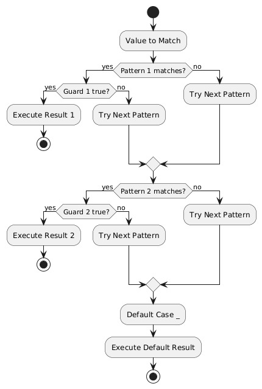

# Day 05: Operators and Control Structures

## Table of Contents
1. [Introduction](#introduction)
2. [Core Concepts](#core-concepts)
3. [Code Examples](#code-examples)
4. [Key Takeaways](#key-takeaways)

---

## Introduction

In Day 04, we explored variable declarations and type inference mechanisms. Today, we examine operators and control structures—the fundamental building blocks for expressing computational logic and program flow. These constructs enable decision-making, iteration, and complex pattern matching in Scala programs.

This session covers arithmetic, relational, and logical operators, followed by control structures including conditional statements, loops, and Scala's powerful pattern matching feature.

---

## Core Concepts

### 1. Operators in Scala

Operators are symbols that perform operations on operands. Unlike some languages where operators are special syntax, Scala treats most operators as methods—maintaining its "everything is an object" philosophy.

#### 1.1 Arithmetic Operators

Arithmetic operators perform mathematical calculations on numeric values.

```scala
val a = 10
val b = 3

val addition = a + b        // 13
val subtraction = a - b     // 7
val multiplication = a * b  // 30
val division = a / b        // 3 (integer division)
val remainder = a % b       // 1 (modulo operation)
```

**Important Concept: Integer Division**

When both operands are integers, division produces an integer result by truncating the decimal portion:

```scala
val intResult = 10 / 3     // 3 (not 3.333...)
val floatResult = 10.0 / 3 // 3.3333...

// To get decimal result from integers, convert at least one operand
val converted = 10.toDouble / 3  // 3.3333...
```

**Method Notation:**

Operators are actually methods, so these are equivalent:

```scala
val sum1 = 5 + 3          // Infix notation (standard)
val sum2 = 5.+(3)         // Method notation (valid but uncommon)
```

#### 1.2 Relational (Comparison) Operators

Relational operators compare values and return Boolean results.

```scala
val x = 5
val y = 10

val equal = x == y        // false (equality check)
val notEqual = x != y     // true (inequality check)
val greater = x > y       // false (greater than)
val less = x < y          // true (less than)
val greaterOrEqual = x >= y  // false (greater than or equal)
val lessOrEqual = x <= y     // true (less than or equal)
```

**Comparison Rules:**
- Works with numeric types
- String comparison uses lexicographic ordering
- Object comparison uses `.equals()` method internally
- Use `==` for value equality, `eq` for reference equality

```scala
val str1 = "hello"
val str2 = "hello"

str1 == str2   // true (value comparison)
str1 eq str2   // May be true or false (reference comparison)
```

#### 1.3 Logical Operators

Logical operators combine or modify Boolean values.

```scala
val isAdult = true
val hasLicense = false

val and = isAdult && hasLicense   // false (both must be true)
val or = isAdult || hasLicense    // true (at least one must be true)
val not = !isAdult                // false (negation)
```

**Short-Circuit Evaluation:**

Logical operators use short-circuit evaluation—they stop evaluating once the result is determined:

```scala
// If first condition is false, second is never evaluated
if (x != 0 && 10 / x > 2) {
  println("Safe division")
}

// If first condition is true, second is never evaluated
if (x == 0 || 10 / x > 2) {
  println("Safe check")
}
```

#### 1.4 Assignment Operators

Assignment operators assign or modify variable values (only work with `var`).

```scala
var count = 10

count += 5   // count = count + 5  →  15
count -= 3   // count = count - 3  →  12
count *= 2   // count = count * 2  →  24
count /= 4   // count = count / 4  →  6
count %= 5   // count = count % 5  →  1
```

**Restriction:**  
Assignment operators only work with mutable variables (`var`), not immutable ones (`val`).

```scala
val immutable = 10
// immutable += 5  // Compilation error!
```

---

### 2. Operator Precedence

Operator precedence determines the order in which operations are evaluated in expressions.

#### 2.1 Precedence Table

| Priority | Operators | Category |
|----------|-----------|----------|
| **1** (Highest) | `()` | Parentheses |
| **2** | `!` `-` (unary) | Unary operators |
| **3** | `*` `/` `%` | Multiplicative |
| **4** | `+` `-` | Additive |
| **5** | `<` `>` `<=` `>=` | Relational |
| **6** | `==` `!=` | Equality |
| **7** | `&&` | Logical AND |
| **8** | `||` | Logical OR |
| **9** (Lowest) | `=` | Assignment |

#### 2.2 Precedence Examples

```scala
// Multiplication before addition
val result1 = 2 + 3 * 4        // 14 (not 20)
// Evaluated as: 2 + (3 * 4)

// Parentheses override precedence
val result2 = (2 + 3) * 4      // 20
// Evaluated as: 5 * 4

// Logical AND before OR
val result3 = true || false && false  // true
// Evaluated as: true || (false && false)
// = true || false
// = true

// Comparison before logical
val result4 = 5 + 3 > 2 * 4    // false
// Evaluated as: (5 + 3) > (2 * 4)
// = 8 > 8
// = false
```

#### 2.3 Best Practice: Use Parentheses for Clarity

While understanding precedence is important, explicit parentheses improve readability:

```scala
// Less clear
val complex = a + b * c > d && e || f

// More clear
val complex = ((a + (b * c)) > d && e) || f
```

---

### 3. Control Structures: Conditional Statements

Control structures direct program flow based on conditions or patterns.

#### 3.1 Basic `if-else` Statement

```scala
val age = 20

if (age >= 18) {
  println("Adult")
} else {
  println("Minor")
}
```

**Syntax Components:**
- `if (condition)` — Boolean expression to evaluate
- `{ body }` — Code block executed if condition is true
- `else { body }` — Optional block executed if condition is false

#### 3.2 `if-else` as Expression

Unlike Java, Scala's `if-else` is an expression—it returns a value:

```scala
val status = if (age >= 18) "Adult" else "Minor"
println(status)  // "Adult"

// Equivalent to Java's ternary operator:
// String status = (age >= 18) ? "Adult" : "Minor";
```

**Type Inference with Expressions:**

```scala
val result = if (condition) 42 else "not a number"
// Type inferred as: Any (common supertype of Int and String)

val numericResult = if (condition) 42 else 0
// Type inferred as: Int (both branches are Int)
```

#### 3.3 Multi-Branch `if-else if-else`

```scala
val score = 85

val grade = if (score >= 90) {
  "A"
} else if (score >= 80) {
  "B"
} else if (score >= 70) {
  "C"
} else if (score >= 60) {
  "D"
} else {
  "F"
}

println(grade)  // "B"
```

**Evaluation Order:**  
Conditions are evaluated sequentially. The first matching condition executes its block, and remaining conditions are skipped.

---

### 4. Pattern Matching: The `match` Expression

Pattern matching is Scala's most powerful control structure—a type-safe, flexible alternative to `switch` statements.

#### 4.1 Basic Value Matching

```scala
val day = "Monday"

val message = day match {
  case "Monday"    => "Start of work week"
  case "Friday"    => "TGIF!"
  case "Saturday" | "Sunday" => "Weekend!"
  case _ => "Regular day"
}

println(message)  // "Start of work week"
```

**Syntax Components:**
- `value match { ... }` — Begin pattern matching on value
- `case pattern => result` — Pattern to match and corresponding result
- `|` — Logical OR for multiple patterns
- `_` — Wildcard pattern (matches anything, like default case)

**Key Differences from Java's `switch`:**
1. Returns a value (is an expression)
2. No fall-through behavior (no `break` needed)
3. Can match on any type, not just primitives and strings
4. Compiler warns about non-exhaustive matches

#### 4.2 Type Matching

Pattern matching can check and extract types:

```scala
def describe(value: Any): String = value match {
  case i: Int      => s"Integer: $i"
  case s: String   => s"String: $s"
  case b: Boolean  => s"Boolean: $b"
  case d: Double   => s"Double: $d"
  case _           => "Unknown type"
}

println(describe(42))       // "Integer: 42"
println(describe("hello"))  // "String: hello"
println(describe(true))     // "Boolean: true"
println(describe(3.14))     // "Double: 3.14"
```

**Type Pattern Benefits:**
- Type-safe: Compiler verifies type compatibility
- Automatic casting: Variable `i`, `s`, `b` automatically typed correctly
- Cleaner than `isInstanceOf` / `asInstanceOf` chains

#### 4.3 Collection Matching

Pattern matching can destructure collections:

```scala
val numbers = List(1, 2, 3, 4, 5)

numbers match {
  case List(1, 2, rest @ _*) => 
    println(s"Starts with 1,2 then $rest")
  case List(first, second, _*) => 
    println(s"First: $first, Second: $second")
  case head :: tail => 
    println(s"Head: $head, Tail: $tail")
  case Nil => 
    println("Empty list")
  case _ => 
    println("Something else")
}

// Output: "Starts with 1,2 then List(3, 4, 5)"
```

**Special Patterns:**
- `_*` — Matches rest of sequence
- `head :: tail` — Matches first element and remainder (cons operator)
- `Nil` — Matches empty list
- `variable @ pattern` — Binds entire matched value to variable

#### 4.4 Guards: Conditional Patterns

Guards add `if` conditions to patterns:

```scala
val age = 25

val category = age match {
  case a if a < 13  => "Child"
  case a if a < 20  => "Teenager"
  case a if a < 65  => "Adult"
  case _            => "Senior"
}

println(category)  // "Adult"
```

**Evaluation:**
1. Pattern matches first
2. Guard condition evaluated
3. If guard true, execute result
4. If guard false, try next case

**Complex Guards:**

```scala
def classifyNumber(n: Int): String = n match {
  case x if x < 0 && x % 2 == 0 => "Negative even"
  case x if x < 0 => "Negative odd"
  case x if x > 0 && x % 2 == 0 => "Positive even"
  case x if x > 0 => "Positive odd"
  case _ => "Zero"
}
```

#### 4.5 Variable Binding in Patterns

Patterns can extract and bind values:

```scala
val pair = ("Alice", 25)

val description = pair match {
  case (name, age) => s"$name is $age years old"
}

println(description)  // "Alice is 25 years old"
```

**Partial Extraction:**

```scala
val triple = (1, 2, 3)

triple match {
  case (first, _, third) => println(s"First: $first, Third: $third")
  // Underscore ignores second element
}
```

#### 4.6 Case Class Matching (Preview)

Case classes (covered later) enable elegant pattern matching:

```scala
case class Person(name: String, age: Int)

val alice = Person("Alice", 25)

val status = alice match {
  case Person(name, age) if age >= 18 => s"Adult: $name"
  case Person(name, age) => s"Minor: $name"
  case _ => "Not a person"
}

println(status)  // "Adult: Alice"
```

---

### 5. Pattern Matching Diagram



---

### 6. Loops: Iteration Structures

#### 6.1 `for` Loop with Ranges

```scala
// Inclusive range (1 to 5 includes both 1 and 5)
for (i <- 1 to 5) {
  println(s"Count: $i")
}
// Output: Count: 1, Count: 2, Count: 3, Count: 4, Count: 5

// Exclusive range (1 until 5 excludes 5)
for (i <- 1 until 5) {
  println(s"Count: $i")
}
// Output: Count: 1, Count: 2, Count: 3, Count: 4
```

#### 6.2 `for` Loop with Guards

Guards filter iterations:

```scala
for (i <- 1 to 10 if i % 2 == 0) {
  println(s"Even: $i")
}
// Output: Even: 2, Even: 4, Even: 6, Even: 8, Even: 10
```

#### 6.3 `for` Loop with Multiple Generators

Multiple generators create nested iterations:

```scala
for {
  i <- 1 to 3
  j <- 1 to 2
} {
  println(s"i=$i, j=$j")
}

// Output:
// i=1, j=1
// i=1, j=2
// i=2, j=1
// i=2, j=2
// i=3, j=1
// i=3, j=2
```

#### 6.4 `for` Loop with Collections

```scala
val fruits = List("apple", "banana", "cherry")

for (fruit <- fruits) {
  println(s"Fruit: $fruit")
}

// With index
for ((fruit, index) <- fruits.zipWithIndex) {
  println(s"$index: $fruit")
}
```

#### 6.5 `for-yield` Expression

`for-yield` creates new collections by transforming elements:

```scala
val numbers = List(1, 2, 3, 4, 5)

val doubled = for (n <- numbers) yield n * 2
println(doubled)  // List(2, 4, 6, 8, 10)

// With guard
val evenDoubled = for (n <- numbers if n % 2 == 0) yield n * 2
println(evenDoubled)  // List(4, 8)
```

**Important:**  
Without `yield`, the loop performs side effects (like printing) but doesn't collect results.

#### 6.6 `while` Loop

```scala
var i = 0

while (i < 5) {
  println(s"While: $i")
  i += 1
}
```

**Characteristics:**
- Condition checked before each iteration
- Requires mutable variable for counter
- Less functional style than `for`

#### 6.7 `do-while` Loop

```scala
var j = 0

do {
  println(s"Do-while: $j")
  j += 1
} while (j < 3)
```

**Characteristics:**
- Body executes at least once
- Condition checked after iteration
- Rarely used in functional Scala

---

### 7. Spark Integration Context

#### 7.1 Pattern Matching in Data Processing

```scala
case class Order(id: String, amount: Double, status: String)

val orders = List(
  Order("1", 100.0, "completed"),
  Order("2", 200.0, "pending"),
  Order("3", 150.0, "completed")
)

// Pattern matching with guards
val messages = orders.map {
  case Order(id, amount, "completed") if amount > 150 =>
    s"High value completed order: $id"
  case Order(id, _, "completed") =>
    s"Regular completed order: $id"
  case Order(id, _, "pending") =>
    s"Pending order: $id"
  case _ =>
    "Unknown status"
}
```

#### 7.2 Transformations with `for-yield`

```scala
// Similar to Spark transformations
val rawData = List(1, 2, 3, 4, 5, 6, 7, 8, 9, 10)

val processed = for {
  num <- rawData
  if num % 2 == 0  // Filter
} yield num * 2    // Map

// Equivalent to:
// val processed = rawData.filter(_ % 2 == 0).map(_ * 2)
```

---

## Code Examples

### Example 1: Grade Calculator
```scala
object GradeCalculator {
  def main(args: Array[String]): Unit = {
    def calculateGrade(score: Int): String = {
      if (score >= 90) "A"
      else if (score >= 80) "B"
      else if (score >= 70) "C"
      else if (score >= 60) "D"
      else "F"
    }
    
    val scores = List(95, 87, 72, 65, 58)
    
    for (score <- scores) {
      val grade = calculateGrade(score)
      println(s"Score $score → Grade $grade")
    }
  }
}
```

### Example 2: Pattern Matching Command Parser
```scala
object CommandParser {
  def main(args: Array[String]): Unit = {
    def processCommand(cmd: String): String = cmd match {
      case "start" => "Starting application..."
      case "stop" => "Stopping application..."
      case "status" => "Application is running"
      case s"set $key=$value" => s"Setting $key to $value"
      case s"get $key" => s"Getting value for $key"
      case _ => "Unknown command"
    }
    
    val commands = List("start", "set debug=true", "status", "get debug", "stop")
    
    for (cmd <- commands) {
      println(s"Command: $cmd → ${processCommand(cmd)}")
    }
  }
}
```

### Example 3: Data Validator
```scala
object DataValidator {
  def main(args: Array[String]): Unit = {
    def validateInput(input: Any): String = input match {
      case s: String if s.nonEmpty => s"Valid string: $s"
      case s: String => "Empty string"
      case i: Int if i > 0 => s"Positive integer: $i"
      case i: Int if i < 0 => s"Negative integer: $i"
      case 0 => "Zero"
      case b: Boolean => s"Boolean value: $b"
      case _ => "Unsupported type"
    }
    
    val inputs: List[Any] = List("hello", "", 42, -10, 0, true, 3.14)
    
    for (input <- inputs) {
      println(validateInput(input))
    }
  }
}
```

### Example 4: Collection Processing
```scala
object CollectionProcessor {
  def main(args: Array[String]): Unit = {
    val numbers = List(1, 2, 3, 4, 5, 6, 7, 8, 9, 10)
    
    // Filter and transform with for-yield
    val evenSquares = for {
      n <- numbers
      if n % 2 == 0
    } yield n * n
    
    println(s"Even squares: $evenSquares")
    
    // Pattern matching on list structure
    numbers match {
      case head :: tail =>
        println(s"First element: $head")
        println(s"Rest: $tail")
      case Nil =>
        println("Empty list")
    }
  }
}
```

---

## Key Takeaways

### Operators
1. **Arithmetic operators** - `+`, `-`, `*`, `/`, `%` for mathematical operations
2. **Integer division** - `10 / 3 = 3` (truncates decimal), use `.toDouble` for precision
3. **Relational operators** - `==`, `!=`, `>`, `<`, `>=`, `<=` for comparisons
4. **Logical operators** - `&&` (AND), `||` (OR), `!` (NOT) with short-circuit evaluation
5. **Assignment operators** - `+=`, `-=`, `*=`, `/=` (only for `var`)

### Operator Precedence
6. **Precedence order** - Parentheses → Unary → Multiplicative → Additive → Relational → Equality → Logical
7. **Use parentheses** - For clarity when multiple operators combine

### Control Structures
8. **`if-else` as expression** - Returns value, can be assigned to variables
9. **Multi-branch conditions** - `if-else if-else` evaluates sequentially
10. **Pattern matching** - More powerful than `switch`, works with any type

### Pattern Matching Features
11. **Value matching** - Match specific values with `case`
12. **Type matching** - Check and extract types safely
13. **Guards** - Add conditions with `if` in patterns
14. **Wildcard** - `_` matches anything (default case)
15. **Collection destructuring** - Extract elements from lists and tuples
16. **No fall-through** - Each case is independent, no `break` needed

### Loops
17. **`for` with ranges** - `1 to 5` (inclusive), `1 until 5` (exclusive)
18. **Guards in loops** - Filter with `if` inside `for`
19. **`for-yield`** - Create new collections through transformation
20. **`while` loops** - Less functional, requires mutable state

### Best Practices
21. **Prefer pattern matching** - Over nested `if-else` for clarity
22. **Use `for-yield`** - Instead of mutable collections when transforming data
23. **Leverage guards** - For complex conditional logic in patterns
24. **Avoid `while` loops** - Prefer functional alternatives when possible

---

## Conclusion

Today's session covered operators and control structures—essential tools for directing program flow and making decisions. Scala's `if-else` expressions return values, promoting functional style. Pattern matching provides type-safe, elegant alternatives to traditional control structures, enabling complex logic with minimal code.

Understanding these constructs prepares you for data processing workflows in Spark, where pattern matching and transformations are fundamental operations.

---

*Document Version: 1.0*  
*Last Updated: Day 05 of Scala Learning Journey*