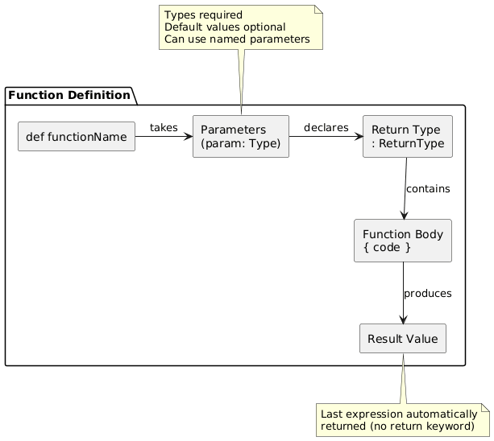

# Day 06: Function Basics in Scala

## Table of Contents
1. [Introduction](#introduction)
2. [Core Concepts](#core-concepts)
3. [Code Examples](#code-examples)
4. [Key Takeaways](#key-takeaways)

---

## Introduction

In Day 05, we explored operators and control structures for directing program flow. Today, we introduce functions—reusable blocks of code that accept inputs, perform operations, and produce outputs. Functions are fundamental to structured programming and essential for writing maintainable, modular code.

This session covers function definition syntax, parameters (including default and named parameters), anonymous functions (lambdas), and the underscore shortcut—foundational concepts for functional programming in Scala.

---

## Core Concepts

### 1. What Are Functions?

**Definition:**  
A function is a named, reusable block of code that performs a specific task. Functions accept input parameters, execute logic, and return a result.

**Purpose:**
- **Code Reuse:** Write once, use many times
- **Modularity:** Break complex problems into smaller pieces
- **Abstraction:** Hide implementation details
- **Testability:** Isolate and verify specific functionality

**Conceptual Analogy:**  
Think of a function as a recipe. You provide ingredients (parameters), follow steps (function body), and produce a dish (return value). The same recipe can be used repeatedly with different ingredients.

---

### 2. Basic Function Definition

#### 2.1 Function Syntax

The basic structure for defining functions in Scala:

```scala
def functionName(parameter: Type): ReturnType = {
  // function body
  // code to execute
  result  // last expression is automatically returned
}
```

**Syntax Components:**
- `def` — Keyword declaring a function definition
- `functionName` — Identifier for the function (follows camelCase convention)
- `parameter: Type` — Input parameter with type annotation
- `: ReturnType` — Declares what type the function returns
- `=` — Separates signature from implementation
- `{ body }` — Code block containing function logic
- `result` — Last expression, automatically returned (no `return` keyword needed)

#### 2.2 Simple Function Examples

```scala
// Function adding two integers
def add(a: Int, b: Int): Int = a + b

// Function multiplying two integers
def multiply(x: Int, y: Int): Int = x * y

// Multi-line function with string manipulation
def greet(name: String): String = {
  val message = s"Hello, $name!"
  message.toUpperCase()
}
```

**Usage:**
```scala
val sum = add(5, 3)            // 8
val product = multiply(2, 4)   // 8
val greeting = greet("Alice")  // "HELLO, ALICE!"

println(sum)
println(product)
println(greeting)
```

#### 2.3 Key Characteristics

**1. Automatic Return:**  
Scala functions automatically return the value of the last expression. The `return` keyword is unnecessary and discouraged.

```scala
// Scala style (preferred)
def add(a: Int, b: Int): Int = a + b

// Java style (valid but uncommon in Scala)
def add(a: Int, b: Int): Int = {
  return a + b
}
```

**2. Parameter Type Annotations:**  
Parameter types must be explicitly declared. The compiler cannot infer them.

```scala
// Valid
def add(a: Int, b: Int): Int = a + b

// Invalid - compiler error
// def add(a, b) = a + b
```

**3. Return Type Inference:**  
Return types can be inferred by the compiler but are recommended for public functions and methods.

```scala
// Type inference (compiler determines Int)
def add(a: Int, b: Int) = a + b

// Explicit return type (recommended for clarity)
def add(a: Int, b: Int): Int = a + b
```

**When to Specify Return Type:**
- Public API functions
- Recursive functions (required)
- When return type isn't obvious
- For documentation purposes

#### 2.4 Single-Line vs Multi-Line Functions

**Single-Line Functions:**

For simple expressions, braces are optional:

```scala
def square(x: Int): Int = x * x
def isEven(n: Int): Boolean = n % 2 == 0
def double(x: Int): Int = x * 2
```

**Multi-Line Functions:**

For complex logic, use braces and multiple statements:

```scala
def calculateGrade(score: Int): String = {
  val percentage = (score / 100.0) * 100
  
  if (percentage >= 90) "A"
  else if (percentage >= 80) "B"
  else if (percentage >= 70) "C"
  else if (percentage >= 60) "D"
  else "F"
}
```

---

### 3. Default Parameters

Default parameters allow functions to be called with fewer arguments by providing default values.

#### 3.1 Defining Default Parameters

```scala
def greet(name: String = "Guest", message: String = "Hello"): String = {
  s"$message, $name!"
}
```

**Syntax:**  
`parameter: Type = defaultValue`

#### 3.2 Using Default Parameters

```scala
// Using all defaults
greet()                        // "Hello, Guest!"

// Overriding first parameter
greet("Alice")                 // "Hello, Alice!"

// Overriding both parameters
greet("Bob", "Hi")             // "Hi, Bob!"

// Overriding second parameter only (requires named parameter)
greet(message = "Welcome")     // "Welcome, Guest!"
```

#### 3.3 Benefits of Default Parameters

1. **Flexibility:** Callers provide only necessary arguments
2. **Backward Compatibility:** Add parameters without breaking existing calls
3. **Reduced Overloading:** Single function instead of multiple overloaded versions
4. **Self-Documenting:** Default values show common usage patterns

**Example: Configuration Function**

```scala
def configureApp(
  appName: String,
  port: Int = 8080,
  environment: String = "development",
  debugMode: Boolean = false
): String = {
  s"App: $appName, Port: $port, Env: $environment, Debug: $debugMode"
}

// Usage scenarios
configureApp("MyApp")                                    // Uses all defaults
configureApp("MyApp", 9090)                              // Custom port
configureApp("MyApp", environment = "production")        // Production mode
configureApp("MyApp", debugMode = true)                  // Enable debugging
```

---

### 4. Named Parameters

Named parameters allow specifying arguments by name rather than position.

#### 4.1 Syntax

```scala
functionName(parameterName = value)
```

#### 4.2 Benefits

**1. Any Order:**  
Arguments can be provided in any order when named.

```scala
def createProfile(name: String, age: Int, country: String): String = {
  s"Name: $name, Age: $age, Country: $country"
}

// Positional arguments (must be in order)
createProfile("Alice", 30, "USA")

// Named arguments (any order)
createProfile(country = "USA", name = "Alice", age = 30)
createProfile(age = 30, country = "USA", name = "Alice")
```

**2. Skip Middle Parameters:**  
Named parameters work perfectly with default parameters.

```scala
def createProfile(
  name: String,
  age: Int = 18,
  country: String = "Unknown"
): String = {
  s"Name: $name, Age: $age, Country: $country"
}

// Skip middle parameter
createProfile("Alice", country = "USA")  // Name: Alice, Age: 18, Country: USA

// Provide only first and last
createProfile(name = "Bob", country = "UK")  // Name: Bob, Age: 18, Country: UK
```

**3. Self-Documenting:**  
Named parameters make code more readable.

```scala
// Less clear
processData("/data/raw", "/data/output", "parquet", 100)

// More clear
processData(
  inputPath = "/data/raw",
  outputPath = "/data/output",
  format = "parquet",
  partitions = 100
)
```

#### 4.3 Combining Positional and Named Parameters

You can mix positional and named arguments, but positional must come first:

```scala
def register(username: String, email: String, age: Int = 18): String = {
  s"User: $username, Email: $email, Age: $age"
}

// Valid: positional first, then named
register("alice", "alice@example.com", age = 25)

// Invalid: named before positional
// register(username = "alice", "alice@example.com")  // Compilation error
```

---

### 5. Practical Example: Data Processing Function

A realistic example combining default and named parameters:

```scala
def processData(
  inputPath: String,
  outputPath: String = "/data/output",
  fileFormat: String = "parquet",
  partitions: Int = 100
): Unit = {
  
  println(s"Processing: $inputPath")
  println(s"Output: $outputPath")
  println(s"Format: $fileFormat")
  println(s"Partitions: $partitions")
  
  // Actual data processing logic would go here
  println("Processing complete!")
}
```

**Usage Scenarios:**

```scala
// Minimal call - use all defaults
processData("/data/raw")

// Override specific parameters
processData("/data/raw", partitions = 200)
processData("/data/raw", fileFormat = "csv")
processData("/data/raw", outputPath = "/data/results", fileFormat = "json")

// Explicit everything
processData(
  inputPath = "/data/raw",
  outputPath = "/data/processed",
  fileFormat = "parquet",
  partitions = 150
)
```

---

### 6. Anonymous Functions (Lambdas)

Anonymous functions, also called lambdas, are functions without names that can be defined inline.

#### 6.1 Anonymous Function Syntax

```scala
val functionName = (parameter: Type) => expression
```

**Syntax Components:**
- `(parameter: Type)` — Parameter list with types
- `=>` — "Fat arrow" separating parameters from body
- `expression` — Function body (can be single expression or block)

#### 6.2 Simple Anonymous Functions

```scala
// Anonymous function assigned to variable
val double = (x: Int) => x * 2

// Function with two parameters
val add = (a: Int, b: Int) => a + b

// Function returning string
val greet = (name: String) => s"Hello, $name"

// Usage
println(double(5))       // 10
println(add(3, 4))       // 7
println(greet("Alice"))  // "Hello, Alice"
```

#### 6.3 Multi-Line Anonymous Functions

For complex logic, use braces:

```scala
val processNumber = (n: Int) => {
  val doubled = n * 2
  val squared = doubled * doubled
  squared + 10
}

println(processNumber(3))  // 46
// Steps: 3 * 2 = 6, 6 * 6 = 36, 36 + 10 = 46
```

#### 6.4 Anonymous Functions in Collections

Anonymous functions are commonly used with collection methods:

```scala
val numbers = List(1, 2, 3, 4, 5)

// Transform each element
val doubled = numbers.map((x: Int) => x * 2)
println(doubled)  // List(2, 4, 6, 8, 10)

// Filter elements
val evens = numbers.filter((x: Int) => x % 2 == 0)
println(evens)    // List(2, 4)

// Calculate sum with custom logic
val sum = numbers.reduce((a: Int, b: Int) => a + b)
println(sum)      // 15
```

---

### 7. Underscore (_) Shortcut

The underscore provides a concise syntax for simple anonymous functions.

#### 7.1 Basic Underscore Usage

When a parameter is used exactly once, `_` can replace it:

```scala
val numbers = List(1, 2, 3, 4, 5)

// Full lambda syntax
numbers.map((x: Int) => x * 2)

// Underscore shortcut
numbers.map(_ * 2)  // List(2, 4, 6, 8, 10)
```

#### 7.2 More Underscore Examples

```scala
val numbers = List(1, 2, 3, 4, 5)

// Filtering
numbers.filter((x: Int) => x > 3)  // Full form
numbers.filter(_ > 3)               // Shortcut → List(4, 5)

// String conversion
numbers.map((x: Int) => x.toString)  // Full form
numbers.map(_.toString)              // Shortcut → List("1", "2", "3", "4", "5")

// Boolean conditions
numbers.exists((x: Int) => x == 3)  // Full form
numbers.exists(_ == 3)              // Shortcut → true
```

#### 7.3 Multiple Underscores

Each underscore represents the next parameter in order:

```scala
val numbers = List(1, 2, 3, 4, 5)

// Addition with two parameters
numbers.reduce((a: Int, b: Int) => a + b)  // Full form
numbers.reduce(_ + _)                       // Shortcut → 15

// First _ is first parameter, second _ is second parameter
```

#### 7.4 When NOT to Use Underscore

**1. Parameter Used Multiple Times:**

```scala
val numbers = List(1, 2, 3, 4, 5)

// Cannot use underscore - x appears twice
numbers.map((x: Int) => x + x)

// This would NOT work:
// numbers.map(_ + _)  // Treats as two different parameters!
```

**2. Complex Expressions:**

For readability, use explicit parameters for complex logic:

```scala
// Hard to read
numbers.filter(_ > 2).map(_ * 2).filter(_ < 10)

// Clearer with named parameters
numbers
  .filter(x => x > 2)
  .map(x => x * 2)
  .filter(x => x < 10)
```

---

### 8. Function Visualization



---

## Code Examples

### Example 1: Basic Function Definitions
```scala
object BasicFunctions {
  def main(args: Array[String]): Unit = {
    // Simple arithmetic functions
    def add(a: Int, b: Int): Int = a + b
    def subtract(a: Int, b: Int): Int = a - b
    def multiply(a: Int, b: Int): Int = a * b
    def divide(a: Int, b: Int): Double = a.toDouble / b
    
    // Testing functions
    println(s"5 + 3 = ${add(5, 3)}")
    println(s"10 - 4 = ${subtract(10, 4)}")
    println(s"6 * 7 = ${multiply(6, 7)}")
    println(s"10 / 3 = ${divide(10, 3)}")
    
    // String manipulation function
    def formatName(firstName: String, lastName: String): String = {
      val fullName = s"$firstName $lastName"
      fullName.toUpperCase()
    }
    
    println(formatName("John", "Doe"))
  }
}
```

### Example 2: Default and Named Parameters
```scala
object ParameterExample {
  def main(args: Array[String]): Unit = {
    // Function with default parameters
    def createUser(
      username: String,
      email: String = "not-provided@example.com",
      age: Int = 18,
      country: String = "Unknown"
    ): String = {
      s"User: $username, Email: $email, Age: $age, Country: $country"
    }
    
    // Various ways to call the function
    println(createUser("alice"))
    println(createUser("bob", "bob@example.com"))
    println(createUser("charlie", age = 25))
    println(createUser("david", country = "USA", age = 30))
    println(createUser(
      username = "eve",
      email = "eve@example.com",
      age = 22,
      country = "UK"
    ))
  }
}
```

### Example 3: Anonymous Functions
```scala
object AnonymousFunctions {
  def main(args: Array[String]): Unit = {
    // Define anonymous functions
    val square = (x: Int) => x * x
    val isEven = (n: Int) => n % 2 == 0
    val concatenate = (s1: String, s2: String) => s1 + " " + s2
    
    // Use anonymous functions
    println(s"Square of 5: ${square(5)}")
    println(s"Is 4 even? ${isEven(4)}")
    println(s"Is 7 even? ${isEven(7)}")
    println(concatenate("Hello", "World"))
    
    // Anonymous functions with collections
    val numbers = List(1, 2, 3, 4, 5)
    
    println(s"Original: $numbers")
    println(s"Doubled: ${numbers.map(x => x * 2)}")
    println(s"Evens only: ${numbers.filter(x => x % 2 == 0)}")
    println(s"Sum: ${numbers.reduce((a, b) => a + b)}")
  }
}
```

### Example 4: Underscore Shortcut
```scala
object UnderscoreShortcut {
  def main(args: Array[String]): Unit = {
    val numbers = List(1, 2, 3, 4, 5, 6, 7, 8, 9, 10)
    
    // Various operations using underscore
    println(s"Original: $numbers")
    println(s"Doubled: ${numbers.map(_ * 2)}")
    println(s"Greater than 5: ${numbers.filter(_ > 5)}")
    println(s"As strings: ${numbers.map(_.toString)}")
    println(s"Sum: ${numbers.reduce(_ + _)}")
    
    // Multiple transformations
    val result = numbers
      .filter(_ % 2 == 0)  // Keep evens
      .map(_ * 3)          // Triple each
      .filter(_ > 10)      // Keep > 10
    
    println(s"Complex transformation: $result")
  }
}
```

---

## Key Takeaways

### Function Basics
1. **def keyword** - declares function definitions
2. **Parameter types required** - compiler cannot infer parameter types
3. **Return type optional** - but recommended for public APIs
4. **Automatic return** - last expression returned, no `return` keyword needed
5. **Single-line syntax** - braces optional for simple expressions

### Parameters
6. **Default parameters** - provide default values with `=`
7. **Named parameters** - specify arguments by name for clarity
8. **Flexible calls** - mix positional and named (positional first)
9. **Skip parameters** - named parameters allow skipping middle arguments
10. **Self-documenting** - named parameters improve code readability

### Anonymous Functions
11. **Lambda syntax** - `(param: Type) => expression`
12. **Inline definitions** - create functions without naming them
13. **Common with collections** - map, filter, reduce use lambdas
14. **Multi-line lambdas** - use braces for complex logic

### Underscore Shortcut
15. **Concise syntax** - `_` replaces parameter when used once
16. **One _ per parameter** - first `_` is first param, second `_` is second param
17. **Readability trade-off** - use for simple expressions only
18. **Cannot reuse** - if parameter appears twice, cannot use `_`

### Best Practices
19. **Prefer explicit types** - for public functions and documentation
20. **Use defaults wisely** - for common configuration values
21. **Named for clarity** - when many parameters or non-obvious order
22. **Keep functions small** - single responsibility principle
23. **Pure functions** - avoid side effects when possible
24. **Descriptive names** - function names should describe what they do

---

## Conclusion

Today's session introduced functions—the building blocks of modular, reusable code. We covered basic function syntax with explicit parameters and return types, explored default and named parameters for flexible APIs, and learned anonymous functions for inline operations.

The underscore shortcut provides concise syntax for simple transformations, particularly useful in collection operations. Understanding these fundamentals prepares you for more advanced functional programming concepts, including higher-order functions and closures, covered in the next session.

Functions enable code organization, reusability, and abstraction—essential skills for building complex Scala applications and working with data processing frameworks like Spark.

---

**Next Session Preview:** Day 07 will explore advanced functional concepts including higher-order functions, closures, lazy evaluation, partial application, and currying.

---

*Document Version: 1.0*  
*Last Updated: Day 06 of Scala Learning Journey*