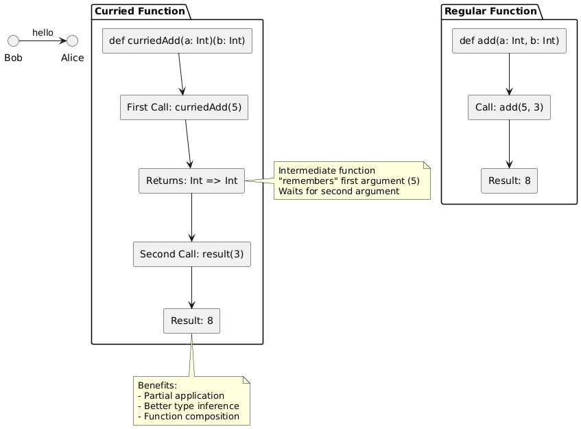

# Day 07: Advanced Functional Concepts in Scala

## Table of Contents
1. [Introduction](#introduction)
2. [Core Concepts](#core-concepts)
3. [Code Examples](#code-examples)
4. [Key Takeaways](#key-takeaways)

---

## Introduction

In Day 06, we explored function basics including definition syntax, default parameters, named parameters, and anonymous functions. Today, we advance to sophisticated functional programming concepts that distinguish Scala as a truly functional language.

This session covers higher-order functions (functions that work with other functions), closures (functions that capture variables from their environment), lazy evaluation (by-name parameters), partial application, and currying. These concepts enable powerful abstraction patterns and code reusability essential for advanced Scala programming and frameworks like Spark.

---

## Core Concepts

### 1. Higher-Order Functions

**Definition:**  
A higher-order function is a function that either:
1. Accepts other functions as parameters, OR
2. Returns a function as its result

**Why Higher-Order Functions Matter:**  
They enable abstraction over behavior, not just data. Instead of writing multiple similar functions, you write one generic function that accepts behavior as a parameter.

#### 1.1 Functions as Parameters

**Basic Example:**

```scala
// Higher-order function accepting function as parameter
def processNumbers(a: Int, b: Int, operation: (Int, Int) => Int): Int = {
  operation(a, b)
}

// Define operations as functions
val add = (x: Int, y: Int) => x + y
val multiply = (x: Int, y: Int) => x * y
val subtract = (x: Int, y: Int) => x - y

// Use higher-order function with different operations
println(processNumbers(5, 3, add))        // 8
println(processNumbers(5, 3, multiply))   // 15
println(processNumbers(5, 3, subtract))   // 2

// Can also pass anonymous function directly
println(processNumbers(5, 3, (x, y) => x - y))  // 2
```

**Explanation:**
- `processNumbers` is a higher-order function
- `operation` parameter has type `(Int, Int) => Int` (function taking two Ints, returning Int)
- Different functions can be passed to achieve different behaviors
- Single generic function replaces multiple specific functions

**Type Signature Breakdown:**

```scala
def processNumbers(
  a: Int,                        // First parameter: Int
  b: Int,                        // Second parameter: Int
  operation: (Int, Int) => Int   // Third parameter: function
): Int                           // Return type: Int
```

The type `(Int, Int) => Int` means:
- Takes two Int parameters
- Returns an Int

#### 1.2 Practical Example: Custom Filtering

```scala
// Generic filter function
def filterNumbers(numbers: List[Int], condition: Int => Boolean): List[Int] = {
  numbers.filter(condition)
}

val numbers = List(1, 2, 3, 4, 5, 6, 7, 8, 9, 10)

// Different filter conditions
val evens = filterNumbers(numbers, x => x % 2 == 0)
val greaterThanFive = filterNumbers(numbers, x => x > 5)
val divisibleByThree = filterNumbers(numbers, x => x % 3 == 0)

println(s"Evens: $evens")                    // List(2, 4, 6, 8, 10)
println(s"Greater than 5: $greaterThanFive") // List(6, 7, 8, 9, 10)
println(s"Divisible by 3: $divisibleByThree") // List(3, 6, 9)
```

#### 1.3 Functions Returning Functions

Higher-order functions can also return functions as results:

```scala
// Function that returns a function
def createMultiplier(factor: Int): Int => Int = {
  (number: Int) => number * factor
}

// Create specialized functions
val double = createMultiplier(2)
val triple = createMultiplier(3)
val quadruple = createMultiplier(4)

println(double(5))      // 10
println(triple(5))      // 15
println(quadruple(5))   // 20
```

**What Happens:**
1. `createMultiplier(2)` returns a function that multiplies by 2
2. That function is assigned to `double`
3. `double(5)` calls the returned function with 5
4. Result: 5 * 2 = 10

**Type Signature:**

```scala
def createMultiplier(factor: Int): Int => Int
                     ↑             ↑
                     Input         Returns function type
```

Return type `Int => Int` means: returns a function that takes Int and returns Int.

#### 1.4 Real-World Example: Validation System

```scala
// Type alias for cleaner code
type Validator = String => Boolean

// Higher-order function for validation
def validateInput(
  input: String,
  validators: List[Validator],
  errorMessages: List[String]
): Either[List[String], String] = {
  
  val errors = validators.zip(errorMessages)
    .filterNot { case (validator, _) => validator(input) }
    .map { case (_, message) => message }
  
  if (errors.isEmpty) Right(input)
  else Left(errors)
}

// Define validators as functions
val notEmpty: Validator = _.nonEmpty
val hasMinLength: Validator = _.length >= 6
val hasUpperCase: Validator = _.exists(_.isUpper)

val validators = List(notEmpty, hasMinLength, hasUpperCase)
val messages = List(
  "Input cannot be empty",
  "Input must be at least 6 characters",
  "Input must contain uppercase letter"
)

// Test validation
val result1 = validateInput("Hello", validators, messages)
val result2 = validateInput("HelloWorld", validators, messages)

println(result1)  // Left(List(Input must be at least 6 characters))
println(result2)  // Right(HelloWorld)
```

---

### 2. Closures

**Definition:**  
A closure is a function that "closes over" (captures) variables from its surrounding scope, remembering them even after that scope has ended.

**Simple Analogy:**  
Imagine a box (closure) that contains a function and also remembers some values from where it was created. The function can use those remembered values every time it's called.

#### 2.1 Basic Closure Example

```scala
def createGreeter(greeting: String): String => String = {
  // The returned function "remembers" the greeting parameter
  (name: String) => s"$greeting, $name!"
}

val helloGreeter = createGreeter("Hello")
val hiGreeter = createGreeter("Hi")
val welcomeGreeter = createGreeter("Welcome")

println(helloGreeter("Alice"))    // "Hello, Alice!"
println(hiGreeter("Bob"))         // "Hi, Bob!"
println(welcomeGreeter("Charlie")) // "Welcome, Charlie!"

// Each greeter "remembers" its greeting
println(helloGreeter("David"))    // Still "Hello, David!"
```

**What's Happening:**
1. `createGreeter("Hello")` creates a function
2. That function captures (closes over) the value "Hello"
3. When we call `helloGreeter("Alice")`, it uses the captured "Hello"
4. Each closure maintains its own captured value

#### 2.2 Closure with Mutable State

```scala
def createCounter(): () => Int = {
  var count = 0  // Mutable variable in outer scope
  
  // Returned function closes over 'count'
  () => {
    count += 1
    count
  }
}

val counter1 = createCounter()
val counter2 = createCounter()

// counter1 maintains its own count
println(counter1())  // 1
println(counter1())  // 2
println(counter1())  // 3

// counter2 has separate count
println(counter2())  // 1
println(counter2())  // 2

// counter1 still maintains its state
println(counter1())  // 4
```

**Key Points:**
- Each call to `createCounter()` creates a new closure with its own `count` variable
- The closure "remembers" its `count` between calls
- Different closures maintain separate state
- This demonstrates encapsulation—external code cannot directly access `count`

#### 2.3 Practical Example: Configuration Builder

```scala
def createConfigBuilder(baseUrl: String, timeout: Int): String => String = {
  // Closure captures baseUrl and timeout
  (endpoint: String) => {
    s"Calling $baseUrl/$endpoint with timeout ${timeout}s"
  }
}

val productionAPI = createConfigBuilder("https://api.prod.com", 30)
val developmentAPI = createConfigBuilder("https://api.dev.com", 60)

println(productionAPI("users"))      // Uses prod URL and 30s timeout
println(developmentAPI("users"))     // Uses dev URL and 60s timeout
println(productionAPI("products"))   // Still uses prod configuration
```

---

### 3. By-Name Parameters (Lazy Evaluation)

**Definition:**  
By-name parameters delay evaluation—the code is not executed when passed, but only when used inside the function.

#### 3.1 Call-By-Value vs Call-By-Name

**Call-By-Value (Normal):**

```scala
def callByValue(x: Int): Unit = {
  println("Inside function")
  println(s"Value: $x")
  println(s"Value again: $x")
}

def expensiveComputation(): Int = {
  println("Computing...")
  Thread.sleep(1000)
  42
}

// Computation happens BEFORE function call
callByValue(expensiveComputation())
// Output:
// Computing...
// Inside function
// Value: 42
// Value again: 42
```

**Call-By-Name (Lazy):**

```scala
def callByName(x: => Int): Unit = {
  println("Inside function")
  println(s"Value: $x")        // Computation happens HERE
  println(s"Value again: $x")  // Computation happens AGAIN
}

// Computation delayed until x is used
callByName(expensiveComputation())
// Output:
// Inside function
// Computing...
// Value: 42
// Computing...
// Value again: 42
```

**Syntax:**  
`x: => Type` (note the `=>` before the type)

#### 3.2 Practical Use Case: Conditional Evaluation

```scala
def printIfTrue(condition: Boolean, message: => String): Unit = {
  if (condition) {
    println(message)
  }
  // If condition is false, message is never evaluated
}

def slowFunction(): String = {
  println("This computation takes time...")
  Thread.sleep(1000)
  "Final Result"
}

// message is never computed because condition is false
printIfTrue(false, slowFunction())  // No output from slowFunction

// message is computed because condition is true
printIfTrue(true, slowFunction())
// Output:
// This computation takes time...
// Final Result
```

**Benefits:**
- Avoids unnecessary computation
- Improves performance when condition is often false
- Enables custom control structures

#### 3.3 Building Custom Control Structures

```scala
def whileLoop(condition: => Boolean)(body: => Unit): Unit = {
  if (condition) {
    body
    whileLoop(condition)(body)  // Recursive call
  }
}

// Usage
var i = 0
whileLoop(i < 5) {
  println(s"Count: $i")
  i += 1
}
// Output: Count: 0, Count: 1, Count: 2, Count: 3, Count: 4
```

**Why It Works:**
- `condition: => Boolean` is evaluated each time (not once at the start)
- `body: => Unit` is evaluated each iteration
- Creates behavior similar to built-in `while` loop

---

### 4. Partial Application

**Definition:**  
Partial application creates a new function by fixing some arguments of an existing function, leaving others to be provided later.

#### 4.1 Basic Partial Application

```scala
// Original function with two parameters
val add = (a: Int, b: Int) => a + b

// Partially apply by fixing first argument
val addFive = (x: Int) => add(5, x)
val addTen = (x: Int) => add(10, x)
val addTwenty = (x: Int) => add(20, x)

println(addFive(3))     // 8  (5 + 3)
println(addFive(7))     // 12 (5 + 7)
println(addTen(3))      // 13 (10 + 3)
println(addTwenty(5))   // 25 (20 + 5)
```

**Explanation:**
- `addFive` is a new function created by partially applying `add`
- First argument (5) is "baked in"
- Second argument is provided when calling `addFive`

#### 4.2 Practical Example: Logger Factory

```scala
def log(level: String, module: String, message: String): Unit = {
  println(s"[$level] [$module] $message")
}

// Create specialized loggers by partial application
val errorLogger = (module: String, message: String) => log("ERROR", module, message)
val infoLogger = (module: String, message: String) => log("INFO", module, message)

// Create module-specific loggers
val dbErrorLogger = (message: String) => errorLogger("Database", message)
val apiErrorLogger = (message: String) => errorLogger("API", message)

// Usage
dbErrorLogger("Connection failed")    // [ERROR] [Database] Connection failed
apiErrorLogger("Request timeout")     // [ERROR] [API] Request timeout
infoLogger("App", "Started")          // [INFO] [App] Started
```

---

### 5. Currying

**Definition:**  
Currying transforms a function taking multiple parameters into a series of functions, each taking a single parameter.

#### 5.1 Regular vs Curried Functions

**Regular Function:**

```scala
def add(a: Int, b: Int): Int = a + b

add(5, 3)  // 8
```

**Curried Function:**

```scala
def curriedAdd(a: Int)(b: Int): Int = a + b

curriedAdd(5)(3)  // 8

// Can partially apply
val addFive = curriedAdd(5) _
println(addFive(3))  // 8
println(addFive(7))  // 12
```

**Syntax Difference:**
- Regular: `def add(a: Int, b: Int)`
- Curried: `def curriedAdd(a: Int)(b: Int)`

Each parameter in separate parentheses.

#### 5.2 Manual Currying

```scala
// Convert regular function to curried
def add(a: Int, b: Int): Int = a + b

def curriedAdd(a: Int): Int => Int = {
  (b: Int) => add(a, b)
}

// Or using curried method
val curriedAddAuto = (add _).curried

// Usage
val addFive = curriedAdd(5)
println(addFive(3))  // 8
```

#### 5.3 Why Currying Is Useful

**1. Partial Application:**

```scala
def multiply(a: Int)(b: Int): Int = a * b

val double = multiply(2) _
val triple = multiply(3) _
val quadruple = multiply(4) _

println(double(5))      // 10
println(triple(5))      // 15
println(quadruple(5))   // 20
```

**2. Building Specialized Functions:**

```scala
def greet(greeting: String)(name: String): String = {
  s"$greeting, $name!"
}

val sayHello = greet("Hello") _
val sayHi = greet("Hi") _
val sayWelcome = greet("Welcome") _

println(sayHello("Alice"))    // "Hello, Alice!"
println(sayHi("Bob"))         // "Hi, Bob!"
println(sayWelcome("Charlie")) // "Welcome, Charlie!"
```

**3. Type Inference Benefits:**

```scala
// Currying allows better type inference in complex scenarios
def foldLeft[A, B](list: List[A])(initial: B)(f: (B, A) => B): B = {
  list match {
    case Nil => initial
    case head :: tail => foldLeft(tail)(f(initial, head))(f)
  }
}

// First parameter group helps compiler infer types for later groups
val numbers = List(1, 2, 3, 4, 5)
val sum = foldLeft(numbers)(0)(_ + _)  // Compiler infers types
```

#### 5.4 Real-World Example: Database Query Builder

```scala
// Curried function for building queries
def query(table: String)(columns: String*)(condition: String): String = {
  val cols = if (columns.isEmpty) "*" else columns.mkString(", ")
  s"SELECT $cols FROM $table WHERE $condition"
}

// Create table-specific query builders
val userQuery = query("users") _
val orderQuery = query("orders") _

// Create column-specific queries
val userBasicInfo = userQuery("id", "name", "email") _
val userFullInfo = userQuery() _  // All columns

// Generate specific queries
println(userBasicInfo("age > 18"))
// SELECT id, name, email FROM users WHERE age > 18

println(userFullInfo("country = 'USA'"))
// SELECT * FROM users WHERE country = 'USA'

println(orderQuery("id", "total")("status = 'pending'"))
// SELECT id, total FROM orders WHERE status = 'pending'
```

---

### 6. Currying Diagram



---

### 7. Why These Concepts Matter

#### 7.1 For Beginners

These concepts might seem abstract, but they enable:

1. **Code Reusability:** Write generic functions, specialize through parameters
2. **Composition:** Build complex behavior from simple functions
3. **Abstraction:** Hide implementation details, expose clean APIs
4. **Performance:** Lazy evaluation avoids unnecessary computation
5. **Encapsulation:** Closures provide private state without classes

#### 7.2 For Spark Programming

```scala
// Higher-order functions in Spark
val data = spark.read.csv("data.csv")

// map, filter, reduce are all higher-order functions
val result = data
  .filter(row => row.age > 18)        // Accepts function
  .map(row => transform(row))         // Accepts function
  .reduce((a, b) => combine(a, b))    // Accepts function

// Closures in Spark
val threshold = 1000
val filtered = data.filter(row => row.amount > threshold)
// threshold is captured by closure

// Currying for configuration
def processData(format: String)(partitions: Int)(data: DataFrame): DataFrame = {
  data.repartition(partitions).write.format(format).save()
}

val saveAsParquet = processData("parquet") _
val saveAsParquet100 = saveAsParquet(100) _
saveAsParquet100(myData)
```

---

### 8. Common Pitfalls

#### 8.1 Side Effects in Pure Functions

```scala
// Bad: Side effect inside function
var total = 0
def badSum(numbers: List[Int]): Int = {
  numbers.foreach(n => total += n)  // Modifies external state
  total
}

// Good: Pure function
def goodSum(numbers: List[Int]): Int = {
  numbers.sum  // No side effects
}
```

#### 8.2 Overcomplicating with Anonymous Functions

```scala
val numbers = List(1, 2, 3, 4, 5)

// Too concise - hard to understand
numbers.map(_ * 2).filter(_ > 5).map(_ - 1)

// Better - named intermediate steps
val doubled = numbers.map(_ * 2)
val filtered = doubled.filter(_ > 5)
val adjusted = filtered.map(_ - 1)

// Or extract complex logic to named function
def complexTransform(n: Int): Int = {
  val doubled = n * 2
  if (doubled > 5) doubled - 1
  else doubled
}
numbers.map(complexTransform)
```

#### 8.3 Misunderstanding By-Name Evaluation

```scala
// By-name parameter is evaluated EACH time it's used
def printTwice(msg: => String): Unit = {
  println(msg)  // Evaluated here
  println(msg)  // Evaluated again here
}

var count = 0
def getMessage(): String = {
  count += 1
  s"Message $count"
}

printTwice(getMessage())
// Output:
// Message 1
// Message 2
// (not Message 1 twice!)
```

---

## Code Examples

### Example 1: Higher-Order Functions
```scala
object HigherOrderFunctions {
  def main(args: Array[String]): Unit = {
    // Function that accepts function as parameter
    def applyOperation(
      x: Int,
      y: Int,
      operation: (Int, Int) => Int
    ): Int = {
      operation(x, y)
    }
    
    // Different operations
    val add = (a: Int, b: Int) => a + b
    val multiply = (a: Int, b: Int) => a * b
    val power = (a: Int, b: Int) => Math.pow(a, b).toInt
    
    println(s"5 + 3 = ${applyOperation(5, 3, add)}")
    println(s"5 * 3 = ${applyOperation(5, 3, multiply)}")
    println(s"5 ^ 3 = ${applyOperation(5, 3, power)}")
    
    // Function returning function
    def createAdder(x: Int): Int => Int = {
      (y: Int) => x + y
    }
    
    val add10 = createAdder(10)
    val add100 = createAdder(100)
    
    println(s"add10(5) = ${add10(5)}")
    println(s"add100(5) = ${add100(5)}")
  }
}
```

### Example 2: Closures
```scala
object ClosureExample {
  def main(args: Array[String]): Unit = {
    // Closure capturing variable
    def createMultiplier(factor: Int): Int => Int = {
      (number: Int) => number * factor
    }
    
    val double = createMultiplier(2)
    val triple = createMultiplier(3)
    
    println(s"double(5) = ${double(5)}")
    println(s"triple(5) = ${triple(5)}")
    
    // Closure with mutable state
    def createCounter(start: Int): () => Int = {
      var count = start
      () => {
        count += 1
        count
      }
    }
    
    val counter = createCounter(0)
    println(s"Count: ${counter()}")  // 1
    println(s"Count: ${counter()}")  // 2
    println(s"Count: ${counter()}")  // 3
  }
}
```

### Example 3: By-Name Parameters
```scala
object ByNameParameters {
  def main(args: Array[String]): Unit = {
    // By-name parameter for lazy evaluation
    def measure[A](operation: => A): (A, Long) = {
      val start = System.currentTimeMillis()
      val result = operation
      val end = System.currentTimeMillis()
      (result, end - start)
    }
    
    // Expensive operation
    def slowComputation(): Int = {
      Thread.sleep(1000)
      42
    }
    
    val (result, time) = measure(slowComputation())
    println(s"Result: $result, Time: ${time}ms")
    
    // Conditional execution
    def executeIf(condition: Boolean)(code: => Unit): Unit = {
      if (condition) code
    }
    
    executeIf(true) {
      println("This executes")
    }
    
    executeIf(false) {
      println("This doesn't execute")
    }
  }
}
```

### Example 4: Currying
```scala
object CurryingExample {
  def main(args: Array[String]): Unit = {
    // Curried function
    def multiply(a: Int)(b: Int): Int = a * b
    
    // Partial application
    val double = multiply(2) _
    val triple = multiply(3) _
    
    println(s"double(5) = ${double(5)}")
    println(s"triple(5) = ${triple(5)}")
    
    // Practical example: String formatter
    def format(prefix: String)(suffix: String)(content: String): String = {
      s"$prefix$content$suffix"
    }
    
    val htmlBold = format("<b>")(""</b>") _
    val htmlItalic = format("<i>")"</i>") _
    val brackets = format("[")("]") _
    
    println(htmlBold("Important"))
    println(htmlItalic("Emphasis"))
    println(brackets("Note"))
  }
}
```

---

## Key Takeaways

### Higher-Order Functions
1. **Functions as parameters** - pass behavior, not just data
2. **Functions as return values** - create customized functions dynamically
3. **Type signatures** - `(Type) => Type` describes function types
4. **Abstraction** - generic code that works with different behaviors

### Closures
5. **Capture variables** - remember values from surrounding scope
6. **Persistent state** - maintain state between calls without classes
7. **Encapsulation** - hide implementation details
8. **Independent instances** - each closure has its own captured variables

### By-Name Parameters
9. **Lazy evaluation** - `x: => Type` delays execution
10. **Evaluated when used** - code runs each time parameter is accessed
11. **Performance optimization** - avoid unnecessary computation
12. **Custom control structures** - build your own if/while/for

### Partial Application
13. **Fix some arguments** - create specialized functions from general ones
14. **Reusability** - one function, many specializations
15. **Configuration** - pre-configure functions with common values

### Currying
16. **Multiple parameter groups** - `def f(a: Type)(b: Type)`
17. **Sequential application** - apply arguments one at a time
18. **Type inference benefits** - helps compiler deduce types
19. **Underscore for partial** - `curriedFn(arg) _` creates partial function
20. **Function composition** - build complex from simple

### Best Practices
21. **Pure functions preferred** - no side effects, predictable behavior
22. **Name complex logic** - extract to named functions for clarity
23. **Avoid over-abstraction** - clarity over cleverness
24. **Understand evaluation** - know when code executes (eager vs lazy)

---

## Conclusion

Today's session explored advanced functional programming concepts that enable powerful abstraction patterns in Scala. Higher-order functions allow treating behavior as data, closures enable encapsulation without classes, lazy evaluation optimizes performance, and currying facilitates partial application and function composition.

These concepts are fundamental to functional programming and essential for understanding Scala's standard library and frameworks like Spark. While they may seem abstract initially, they become intuitive with practice and enable writing more expressive, reusable, and maintainable code.

Mastering these concepts transitions you from writing procedural Scala code to thinking functionally—a paradigm shift that unlocks Scala's full potential.

---

*Document Version: 1.0*  
*Last Updated: Day 07 of Scala Learning Journey*