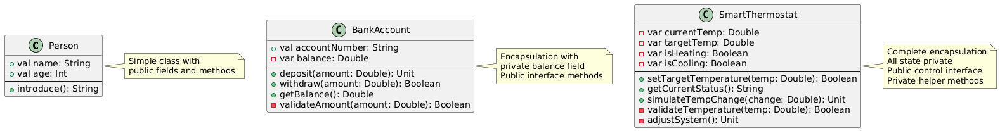

# Day 08: Classes and Object-Oriented Programming Features

## Table of Contents
1. [Introduction](#introduction)
2. [Core Concepts](#core-concepts)
3. [Code Examples](#code-examples)
4. [Key Takeaways](#key-takeaways)

---

## Introduction

In Day 07, we explored advanced functional programming concepts including higher-order functions, closures, and currying. Today, we shift focus to object-oriented programming (OOP) in Scala—the paradigm for organizing code around objects that combine data and behavior.

This session covers classes (blueprints for objects), objects (instances of classes), constructors (initialization mechanisms), methods (functions within classes), and access modifiers (controlling visibility). Understanding OOP is essential for building structured, maintainable applications and working with frameworks like Spark that use object-oriented APIs.

---

## Core Concepts

### 1. Understanding Classes and Objects

#### 1.1 What Are Classes?

**Definition:**  
A class is a blueprint or template that defines the structure and behavior of objects. It specifies what data (fields) and operations (methods) objects of that class will have.

**Analogy:**  
Think of a class as a cookie cutter—it defines the shape. Objects are the actual cookies created using that cutter.

**Purpose:**
- **Organization:** Group related data and functions together
- **Reusability:** Create multiple objects from one class definition
- **Abstraction:** Hide implementation details, expose clean interfaces
- **Modularity:** Break complex systems into manageable pieces

#### 1.2 What Are Objects?

**Definition:**  
An object is an instance of a class—a concrete entity created from the class blueprint with its own data.

**Characteristics:**
- Each object has its own state (field values)
- All objects of the same class share the same behavior (methods)
- Objects are created using the `new` keyword

---

### 2. Basic Class Syntax

#### 2.1 Simple Class Definition

```scala
class Person(val name: String, val age: Int) {
  def introduce(): String = {
    s"Hi, I'm $name and I'm $age years old"
  }
}

// Creating objects (instances)
val alice = new Person("Alice", 25)
val bob = new Person("Bob", 30)

// Using objects
println(alice.introduce())  // Hi, I'm Alice and I'm 25 years old
println(bob.introduce())    // Hi, I'm Bob and I'm 30 years old
```

**Syntax Breakdown:**

```scala
class ClassName(parameters) {
  // Class body
  // Fields and methods
}
```

- `class` — Keyword declaring a class
- `ClassName` — Class name (PascalCase convention)
- `(parameters)` — Constructor parameters
- `{ body }` — Class definition containing methods and fields

#### 2.2 Comparison with Java

**Java:**
```java
public class Person {
    private String name;
    private int age;
    
    public Person(String name, int age) {
        this.name = name;
        this.age = age;
    }
    
    public String introduce() {
        return "Hi, I'm " + name + " and I'm " + age + " years old";
    }
    
    public String getName() {
        return name;
    }
    
    public int getAge() {
        return age;
    }
}
```

**Scala:**
```scala
class Person(val name: String, val age: Int) {
  def introduce(): String = {
    s"Hi, I'm $name and I'm $age years old"
  }
}
```

**Key Differences:**
1. Constructor parameters directly in class definition
2. `val`/`var` automatically creates fields with getters
3. No explicit getter methods needed
4. String interpolation with `s"..."`
5. Much more concise

---

### 3. Fields: val vs var

Fields store object state. Scala provides two types:

#### 3.1 Immutable Fields (val)

```scala
class Person(val name: String, val age: Int)

val person = new Person("Alice", 25)

println(person.name)  // Alice (can read)
// person.name = "Bob"  // Compilation error - val is immutable
```

**Characteristics:**
- Cannot be reassigned after initialization
- Similar to Java's `final` fields
- Preferred in functional programming
- Thread-safe by default

#### 3.2 Mutable Fields (var)

```scala
class Counter(var count: Int) {
  def increment(): Unit = {
    count += 1
  }
}

val counter = new Counter(0)
println(counter.count)  // 0

counter.increment()
println(counter.count)  // 1

counter.count = 10      // Can reassign - var is mutable
println(counter.count)  // 10
```

**Characteristics:**
- Can be reassigned
- Similar to regular Java fields
- Use sparingly in functional code
- Requires careful management in concurrent environments

#### 3.3 Constructor Parameters Without val/var

```scala
class Example(name: String) {
  // name is only a constructor parameter, not a field
  def greet(): String = s"Hello, $name"
}

val ex = new Example("Alice")
println(ex.greet())   // Hello, Alice
// println(ex.name)   // Compilation error - not a field
```

When to use each:
- `val` — Parameter becomes public immutable field
- `var` — Parameter becomes public mutable field
- Neither — Parameter only available in constructor and class body

---

### 4. Methods

Methods are functions defined within a class that operate on the object's data.

#### 4.1 Method Syntax

```scala
def methodName(parameter: Type): ReturnType = {
  // method body
  result
}
```

#### 4.2 Instance Methods

```scala
class BankAccount(val accountNumber: String, private var balance: Double) {
  
  // Method returning Unit (no meaningful return value)
  def deposit(amount: Double): Unit = {
    if (amount > 0) {
      balance += amount
      println(s"Deposited: $$${amount}. New balance: $$${balance}")
    } else {
      println("Deposit amount must be positive")
    }
  }
  
  // Method returning Boolean
  def withdraw(amount: Double): Boolean = {
    if (amount > 0 && amount <= balance) {
      balance -= amount
      println(s"Withdrew: $$${amount}. New balance: $$${balance}")
      true
    } else {
      println("Insufficient funds or invalid amount")
      false
    }
  }
  
  // Method returning Double
  def getBalance(): Double = {
    balance
  }
}
```

**Method Characteristics:**
- Operate on object's state (fields)
- Can modify mutable fields
- Can call other methods
- Return values or Unit

#### 4.3 Using Methods

```scala
val account = new BankAccount("ACC001", 1000.0)

account.deposit(500)        // Deposited: $500.0. New balance: $1500.0
account.withdraw(200)       // Withdrew: $200.0. New balance: $1300.0
account.withdraw(2000)      // Insufficient funds or invalid amount

val balance = account.getBalance()
println(s"Current balance: $balance")  // Current balance: 1300.0
```

---

### 5. Constructors

Constructors initialize objects when they're created. Scala provides primary and auxiliary constructors.

#### 5.1 Primary Constructor

The primary constructor is defined directly in the class header:

```scala
class Person(val name: String, val age: Int) {
  // This code runs when object is created
  println(s"Creating person: $name")
  
  // Validation in constructor
  require(age >= 0, "Age must be non-negative")
  require(name.nonEmpty, "Name cannot be empty")
}

val person = new Person("Alice", 25)
// Output: Creating person: Alice
```

**Constructor Body:**  
Any code in the class body (not in methods) is part of the primary constructor and runs during object creation.

#### 5.2 Default Parameter Values

```scala
class Car(val make: String, val model: String, val year: Int = 2020) {
  def info(): String = s"$year $make $model"
}

// Different ways to create objects
val car1 = new Car("Toyota", "Camry", 2022)  // All parameters
val car2 = new Car("Honda", "Civic")          // Uses default year
val car3 = new Car("Ford", "Mustang", year = 2021)  // Named parameter

println(car1.info())  // 2022 Toyota Camry
println(car2.info())  // 2020 Honda Civic
println(car3.info())  // 2021 Ford Mustang
```

#### 5.3 Auxiliary Constructors

Auxiliary constructors provide alternative ways to create objects. They must call the primary constructor.

```scala
class Student(val name: String, val age: Int, val grade: String) {
  // This is the primary constructor
  
  // Auxiliary constructor 1: Without grade
  def this(name: String, age: Int) = {
    this(name, age, "Not Assigned")  // Must call primary constructor
  }
  
  // Auxiliary constructor 2: Only name
  def this(name: String) = {
    this(name, 18, "Not Assigned")  // Can call primary or other auxiliary
  }
  
  def display(): String = s"$name, Age: $age, Grade: $grade"
}

// Using different constructors
val student1 = new Student("Alice", 15, "10th")  // Primary
val student2 = new Student("Bob", 16)             // Auxiliary 1
val student3 = new Student("Charlie")             // Auxiliary 2

println(student1.display())  // Alice, Age: 15, Grade: 10th
println(student2.display())  // Bob, Age: 16, Grade: Not Assigned
println(student3.display())  // Charlie, Age: 18, Grade: Not Assigned
```

**Rules for Auxiliary Constructors:**
1. Defined using `def this(...)`
2. Must call another constructor as first statement
3. Eventually chains to primary constructor
4. Cannot access class fields before calling primary constructor

---

### 6. Access Modifiers

Access modifiers control visibility of class members.

#### 6.1 Public (Default)

In Scala, members are public by default—no keyword needed.

```scala
class Book(val title: String, val author: String) {
  // title and author are public
  
  def info(): String = s"$title by $author"  // Public method
}

val book = new Book("Scala Guide", "John Doe")
println(book.title)   // OK - public
println(book.author)  // OK - public
println(book.info())  // OK - public method
```

#### 6.2 Private

Private members are only accessible within the class.

```scala
class BankAccount(initialBalance: Double) {
  private var balance = initialBalance  // Private field
  
  // Public method to access private field
  def getBalance(): Double = balance
  
  // Public methods to modify private field (with validation)
  def deposit(amount: Double): Unit = {
    if (amount > 0) {
      balance += amount
    }
  }
  
  def withdraw(amount: Double): Boolean = {
    if (amount > 0 && amount <= balance) {
      balance -= amount
      true
    } else {
      false
    }
  }
  
  // Private helper method
  private def validateAmount(amount: Double): Boolean = {
    amount > 0 && amount <= 10000
  }
}

val account = new BankAccount(1000)
account.deposit(500)
println(account.getBalance())  // 1500 - OK (public method)

// These would cause errors:
// println(account.balance)        // Error - balance is private
// account.validateAmount(100)     // Error - method is private
```

**Benefits of Private Fields:**
- Encapsulation: Hide implementation details
- Validation: Control how data is modified
- Flexibility: Change internal implementation without affecting external code

#### 6.3 Protected

Protected members are accessible within the class and its subclasses.

```scala
class Animal {
  protected var energy = 100  // Protected - class and children can access
  private var hunger = 0      // Private - only this class
  
  def sleep(): Unit = {
    energy += 20
    println(s"Sleeping... Energy: $energy")
  }
}

class Dog extends Animal {
  def bark(): Unit = {
    energy -= 5  // OK - Dog can access protected energy
    println(s"Woof! Energy: $energy")
  }
  
  // Cannot access hunger - it's private in Animal
}

val dog = new Dog()
dog.bark()   // Woof! Energy: 95
dog.sleep()  // Sleeping... Energy: 115

// dog.energy  // Error - protected, not accessible from outside
```

#### 6.4 Access Modifiers Summary

| Modifier | Same Class | Subclass | Other Classes |
|----------|-----------|----------|---------------|
| (none) Public | ✅ | ✅ | ✅ |
| Protected | ✅ | ✅ | ❌ |
| Private | ✅ | ❌ | ❌ |

---

### 7. Class Design Example: Smart Thermostat

Complete example demonstrating all concepts:

```scala
class SmartThermostat(initialTemp: Double, initialTarget: Double = 20.0) {
  // Private state - hidden from outside
  private var currentTemp: Double = initialTemp
  private var targetTemp: Double = initialTarget
  private var isHeating: Boolean = false
  private var isCooling: Boolean = false
  
  // Validate initial values
  require(validateTemperature(initialTemp), "Invalid initial temperature")
  require(validateTemperature(initialTarget), "Invalid target temperature")
  
  // Constructor code - runs on creation
  println(s"Thermostat initialized at $currentTemp°C")
  adjustSystem()
  
  // Public methods - external interface
  def setTargetTemperature(temp: Double): Boolean = {
    if (validateTemperature(temp)) {
      targetTemp = temp
      adjustSystem()
      true
    } else {
      println("Temperature must be between 10°C and 35°C")
      false
    }
  }
  
  def getCurrentStatus(): String = {
    val mode = if (isHeating) "Heating"
               else if (isCooling) "Cooling"
               else "Idle"
    s"Current: ${currentTemp}°C, Target: ${targetTemp}°C, Mode: $mode"
  }
  
  def simulateTempChange(change: Double): Unit = {
    currentTemp += change
    adjustSystem()
    println(getCurrentStatus())
  }
  
  // Private helper methods - internal logic
  private def validateTemperature(temp: Double): Boolean = {
    temp >= 10 && temp <= 35
  }
  
  private def adjustSystem(): Unit = {
    if (currentTemp < targetTemp - 2) {
      isHeating = true
      isCooling = false
    } else if (currentTemp > targetTemp + 2) {
      isHeating = false
      isCooling = true
    } else {
      isHeating = false
      isCooling = false
    }
  }
}

// Usage
val thermostat = new SmartThermostat(18.0, 22.0)
// Output: Thermostat initialized at 18.0°C

println(thermostat.getCurrentStatus())
// Current: 18.0°C, Target: 22.0°C, Mode: Heating

thermostat.setTargetTemperature(25.0)
thermostat.simulateTempChange(3.0)
// Current: 21.0°C, Target: 25.0°C, Mode: Heating

// Cannot access private members:
// thermostat.currentTemp = 30  // Error
// thermostat.adjustSystem()    // Error
```

---

### 8. Class Diagram



---

## Code Examples

### Example 1: Basic Class with Methods
```scala
object BasicClassExample {
  def main(args: Array[String]): Unit = {
    // Define a simple class
    class Rectangle(val width: Double, val height: Double) {
      def area(): Double = width * height
      
      def perimeter(): Double = 2 * (width + height)
      
      def isSquare(): Boolean = width == height
      
      def info(): String = {
        s"Rectangle: ${width}x${height}, Area: ${area()}, Perimeter: ${perimeter()}"
      }
    }
    
    // Create objects
    val rect1 = new Rectangle(5, 3)
    val rect2 = new Rectangle(4, 4)
    
    // Use methods
    println(rect1.info())
    println(s"Is square? ${rect1.isSquare()}")
    
    println(rect2.info())
    println(s"Is square? ${rect2.isSquare()}")
  }
}
```

### Example 2: Class with Mutable State
```scala
object MutableStateExample {
  def main(args: Array[String]): Unit = {
    class Counter(var count: Int = 0) {
      def increment(): Unit = count += 1
      
      def decrement(): Unit = count -= 1
      
      def reset(): Unit = count = 0
      
      def display(): String = s"Count: $count"
    }
    
    val counter = new Counter()
    println(counter.display())  // Count: 0
    
    counter.increment()
    counter.increment()
    counter.increment()
    println(counter.display())  // Count: 3
    
    counter.decrement()
    println(counter.display())  // Count: 2
    
    counter.reset()
    println(counter.display())  // Count: 0
  }
}
```

### Example 3: Auxiliary Constructors
```scala
object AuxiliaryConstructorsExample {
  def main(args: Array[String]): Unit = {
    class Employee(val name: String, val id: String, val department: String, val salary: Double) {
      
      // Auxiliary constructor: without salary
      def this(name: String, id: String, department: String) = {
        this(name, id, department, 50000.0)  // Default salary
      }
      
      // Auxiliary constructor: without department and salary
      def this(name: String, id: String) = {
        this(name, id, "General", 50000.0)
      }
      
      def info(): String = {
        s"Employee: $name, ID: $id, Dept: $department, Salary: $$$salary"
      }
    }
    
    // Using different constructors
    val emp1 = new Employee("Alice", "E001", "Engineering", 75000.0)
    val emp2 = new Employee("Bob", "E002", "Sales")
    val emp3 = new Employee("Charlie", "E003")
    
    println(emp1.info())
    println(emp2.info())
    println(emp3.info())
  }
}
```

### Example 4: Encapsulation with Private Fields
```scala
object EncapsulationExample {
  def main(args: Array[String]): Unit = {
    class Temperature(private var celsius: Double) {
      // Getter for celsius
      def getCelsius(): Double = celsius
      
      // Setter with validation
      def setCelsius(temp: Double): Boolean = {
        if (temp >= -273.15) {  // Absolute zero
          celsius = temp
          true
        } else {
          println("Temperature below absolute zero!")
          false
        }
      }
      
      // Computed property
      def getFahrenheit(): Double = (celsius * 9.0 / 5.0) + 32
      
      // Computed property
      def getKelvin(): Double = celsius + 273.15
      
      def display(): String = {
        f"Temperature: $celsius%.1f°C = ${getFahrenheit()}%.1f°F = ${getKelvin()}%.1fK"
      }
    }
    
    val temp = new Temperature(25.0)
    println(temp.display())
    
    temp.setCelsius(0.0)
    println(temp.display())
    
    temp.setCelsius(-300.0)  // Below absolute zero - rejected
    println(temp.display())  // Still 0°C
  }
}
```

---

## Key Takeaways

### Classes and Objects
1. **Classes are blueprints** - define structure and behavior
2. **Objects are instances** - created with `new` keyword
3. **Constructor in class header** - parameters right in class definition
4. **Concise syntax** - much shorter than Java

### Fields
5. **val creates immutable fields** - cannot be reassigned
6. **var creates mutable fields** - can be reassigned
7. **No val/var** - parameter only available in constructor
8. **Prefer val** - immutability is safer and more functional

### Methods
9. **def declares methods** - functions within classes
10. **Operate on object state** - access and modify fields
11. **Return types** - Unit, Boolean, Int, String, custom types
12. **this keyword** - refers to current object (usually implicit)

### Constructors
13. **Primary constructor** - in class header, code in class body
14. **Default parameters** - provide default values for flexibility
15. **Auxiliary constructors** - `def this(...)` for alternatives
16. **Must call primary** - auxiliary constructors chain to primary

### Access Modifiers
17. **Public by default** - no keyword needed (unlike Java)
18. **Private restricts** - only accessible within class
19. **Protected allows subclasses** - class and children can access
20. **Encapsulation** - hide implementation, expose interface

### Best Practices
21. **Encapsulate state** - make fields private, provide methods
22. **Validate in constructor** - use `require` for preconditions
23. **Immutability preferred** - use `val` unless mutation necessary
24. **Descriptive names** - methods should describe their action
25. **Single responsibility** - each class should have one clear purpose

---

## Conclusion

Today's session introduced object-oriented programming in Scala, covering classes, objects, constructors, methods, and access modifiers. These concepts enable organizing code into logical, reusable units that combine data and behavior.

Scala's class syntax is significantly more concise than Java's while providing the same functionality. The `val`/`var` distinction in constructor parameters automatically creates fields, eliminating boilerplate getter/setter code. Access modifiers (public by default, private, protected) enable encapsulation—hiding implementation details while exposing clean interfaces.

Understanding classes and OOP is fundamental for building structured applications and working with Scala's standard library and frameworks like Spark, which extensively use object-oriented patterns.

---

**Next Session Preview:** Day 09 will explore the three pillars of OOP—inheritance (parent-child relationships), polymorphism (same interface, different implementations), and encapsulation in depth.

---

*Document Version: 1.0*  
*Last Updated: Day 08 of Scala Learning Journey*