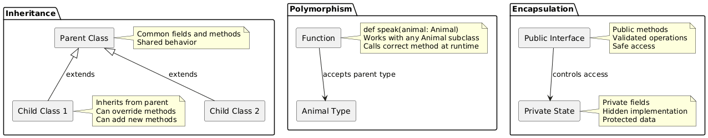

# Day 09: The Three Pillars of Object-Oriented Programming

## Table of Contents
1. [Introduction](#introduction)
2. [Core Concepts](#core-concepts)
3. [Code Examples](#code-examples)
4. [Key Takeaways](#key-takeaways)

---

## Introduction

In Day 08, we learned the fundamentals of classes, objects, constructors, methods, and access modifiers. Today, we explore the three pillars of object-oriented programming: **inheritance** (parent-child relationships), **polymorphism** (same interface, different implementations), and **encapsulation** (data protection and information hiding).

These principles enable code reuse, flexible design, and maintainable systems. Understanding them is essential for designing robust object-oriented applications and working with frameworks like Spark that extensively use these patterns.

---

## Core Concepts

### 1. Inheritance: Parent-Child Relationships

#### 1.1 What Is Inheritance?

**Definition:**  
Inheritance is a mechanism where a new class (child/subclass) is created based on an existing class (parent/superclass), inheriting its fields and methods while adding or modifying functionality.

**Purpose:**
- **Code Reuse:** Avoid duplicating common functionality
- **Hierarchy:** Model "is-a" relationships (Dog is an Animal)
- **Specialization:** Add specific features to general concepts
- **Maintenance:** Change shared behavior in one place

**Real-World Analogy:**  
Consider vehicles: all vehicles have wheels and engines, but cars, motorcycles, and trucks have specific additional features. Inheritance models this hierarchy.

**Terminology:**
- **Superclass/Parent/Base Class:** The class being inherited from
- **Subclass/Child/Derived Class:** The class that inherits
- **extends:** Keyword to establish inheritance relationship

#### 1.2 Basic Inheritance Syntax

```scala
// Parent class
class Animal(val name: String) {
  def makeSound(): String = "Some animal sound"
  def eat(): String = s"$name is eating"
  def sleep(): String = s"$name is sleeping"
}

// Child class inheriting from Animal
class Dog(name: String) extends Animal(name) {
  // Override parent method
  override def makeSound(): String = "Woof! Woof!"
  
  // Add new method specific to Dog
  def fetch(): String = s"$name is fetching the ball"
}

// Another child class
class Cat(name: String) extends Animal(name) {
  override def makeSound(): String = "Meow!"
  
  def climb(): String = s"$name is climbing a tree"
}
```

**Syntax Components:**
- `extends Animal(name)` — Inherit from Animal, pass name to parent constructor
- `override` — Required keyword when changing parent's method
- New methods can be added without override

#### 1.3 Using Inherited Classes

```scala
val dog = new Dog("Buddy")
val cat = new Cat("Whiskers")

// Inherited methods work automatically
println(dog.eat())     // Buddy is eating (inherited)
println(cat.sleep())   // Whiskers is sleeping (inherited)

// Overridden methods use child's version
println(dog.makeSound())  // Woof! Woof! (overridden)
println(cat.makeSound())  // Meow! (overridden)

// New methods specific to each child
println(dog.fetch())   // Buddy is fetching the ball
println(cat.climb())   // Whiskers is climbing a tree
```

#### 1.4 The override Keyword

In Scala, `override` is **mandatory** when modifying a parent's method.

```scala
class Animal {
  def speak(): String = "Sound"
}

class Dog extends Animal {
  // Without override - compilation error
  // def speak(): String = "Woof"
  
  // With override - correct
  override def speak(): String = "Woof"
}
```

**Why This Is Important:**
- Prevents accidental name collisions
- Makes intention explicit
- Compiler catches errors if parent method doesn't exist
- Better than Java's optional `@Override`

#### 1.5 Calling Parent Methods with super

Sometimes you want to extend parent functionality rather than completely replace it:

```scala
class Employee(val name: String, val id: String) {
  def getInfo(): String = s"Employee: $name, ID: $id"
  def work(): String = s"$name is working"
}

class Manager(name: String, id: String, val teamSize: Int) 
  extends Employee(name, id) {
  
  // Use parent's method and add more
  override def getInfo(): String = {
    super.getInfo() + s", Team Size: $teamSize"
  }
  
  // Completely override
  override def work(): String = {
    s"$name is managing a team of $teamSize"
  }
  
  // New method
  def conductMeeting(): String = s"$name is conducting a meeting"
}

val employee = new Employee("Alice", "E001")
val manager = new Manager("Bob", "M001", 5)

println(employee.getInfo())
// Employee: Alice, ID: E001

println(manager.getInfo())
// Employee: Bob, ID: M001, Team Size: 5

println(manager.work())
// Bob is managing a team of 5
```

**super Keyword:**
- Refers to parent class
- `super.methodName()` calls parent's version
- Useful for extending behavior rather than replacing

---

### 2. Polymorphism: Many Forms

#### 2.1 What Is Polymorphism?

**Definition:**  
Polymorphism means "many forms"—the ability for objects of different types to be treated uniformly while exhibiting different behaviors.

**Key Concept:**  
Same method call, different behavior depending on the actual object type.

**Real-World Analogy:**  
You tell different animals to "make a sound." Each animal responds differently (dog barks, cat meows, bird chirps), but you use the same command.

#### 2.2 Polymorphism in Action

```scala
class Animal(val name: String) {
  def makeSound(): String = "Generic sound"
}

class Dog(name: String) extends Animal(name) {
  override def makeSound(): String = "Woof!"
}

class Cat(name: String) extends Animal(name) {
  override def makeSound(): String = "Meow!"
}

class Cow(name: String) extends Animal(name) {
  override def makeSound(): String = "Moo!"
}

// Polymorphic function - accepts ANY Animal
def letAnimalSpeak(animal: Animal): Unit = {
  println(s"${animal.name} says: ${animal.makeSound()}")
}

// Create different animals
val dog = new Dog("Buddy")
val cat = new Cat("Whiskers")
val cow = new Cow("Bessie")

// Same function call, different behaviors
letAnimalSpeak(dog)  // Buddy says: Woof!
letAnimalSpeak(cat)  // Whiskers says: Meow!
letAnimalSpeak(cow)  // Bessie says: Moo!
```

**What's Happening:**
1. `letAnimalSpeak` expects an `Animal` parameter
2. We pass `Dog`, `Cat`, `Cow` (all are Animals through inheritance)
3. The correct `makeSound()` is called automatically based on actual type
4. This is **runtime polymorphism** (dynamic dispatch)

#### 2.3 Collections of Polymorphic Objects

```scala
// Store different types in one collection
val animals: List[Animal] = List(
  new Dog("Buddy"),
  new Cat("Whiskers"),
  new Cow("Bessie")
)

// Process all uniformly
for (animal <- animals) {
  letAnimalSpeak(animal)
}

// Output:
// Buddy says: Woof!
// Whiskers says: Meow!
// Bessie says: Moo!
```

**Benefits:**
- Write code that works with entire hierarchies
- Extend functionality by adding new subclasses
- No need to modify existing code

---

### 3. Abstract Classes

#### 3.1 What Are Abstract Classes?

**Definition:**  
An abstract class is a class that cannot be instantiated directly. It serves as a blueprint for other classes and may contain abstract methods (methods without implementation).

**Purpose:**
- Define common interface for related classes
- Force subclasses to implement specific methods
- Share common implementation while requiring specific behaviors

```scala
// Abstract class
abstract class Shape {
  def area(): Double        // Abstract method - no implementation
  def perimeter(): Double   // Abstract method
  
  // Concrete method - has implementation
  def describe(): String = "I am a shape"
}

// Cannot create Shape directly
// val shape = new Shape()  // Compilation error!
```

#### 3.2 Implementing Abstract Classes

```scala
abstract class Shape {
  def area(): Double
  def perimeter(): Double
  def describe(): String = "I am a shape"
}

// Concrete class - must implement abstract methods
class Circle(val radius: Double) extends Shape {
  override def area(): Double = Math.PI * radius * radius
  override def perimeter(): Double = 2 * Math.PI * radius
}

class Rectangle(val width: Double, val height: Double) extends Shape {
  override def area(): Double = width * height
  override def perimeter(): Double = 2 * (width + height)
}

class Triangle(val base: Double, val height: Double, 
               val side1: Double, val side2: Double) extends Shape {
  override def area(): Double = 0.5 * base * height
  override def perimeter(): Double = base + side1 + side2
}
```

#### 3.3 Using Abstract Classes Polymorphically

```scala
def printShapeInfo(shape: Shape): Unit = {
  println(shape.describe())
  println(f"Area: ${shape.area()}%.2f")
  println(f"Perimeter: ${shape.perimeter()}%.2f")
  println("---")
}

val circle = new Circle(5)
val rectangle = new Rectangle(4, 6)
val triangle = new Triangle(3, 4, 5, 4)

// Polymorphism with abstract classes
printShapeInfo(circle)
// I am a shape
// Area: 78.54
// Perimeter: 31.42
// ---

printShapeInfo(rectangle)
// I am a shape
// Area: 24.00
// Perimeter: 20.00
// ---

printShapeInfo(triangle)
// I am a shape
// Area: 6.00
// Perimeter: 12.00
// ---
```

---

### 4. Real-World Example: Payment System

Complete example combining inheritance, polymorphism, and abstract classes:

```scala
// Abstract base class
abstract class Payment(val amount: Double) {
  def processPayment(): String  // Abstract - each type implements differently
  def refund(): String = f"Refunding $$${amount}%.2f"  // Concrete - shared
}

// Concrete payment types
class CreditCardPayment(amount: Double, val cardNumber: String) 
  extends Payment(amount) {
  
  override def processPayment(): String = {
    val lastFour = cardNumber.takeRight(4)
    f"Processing credit card payment of $$${amount}%.2f using card ending in $lastFour"
  }
}

class PayPalPayment(amount: Double, val email: String) 
  extends Payment(amount) {
  
  override def processPayment(): String = {
    f"Processing PayPal payment of $$${amount}%.2f to $email"
  }
}

class CryptoPayment(amount: Double, val walletAddress: String, val currency: String) 
  extends Payment(amount) {
  
  override def processPayment(): String = {
    f"Processing $currency payment of $$${amount}%.2f to wallet $walletAddress"
  }
}

// Payment processor using polymorphism
class PaymentProcessor {
  def process(payment: Payment): Unit = {
    println(payment.processPayment())
    println("Payment successful!")
  }
  
  def processMultiple(payments: List[Payment]): Unit = {
    println(s"Processing ${payments.length} payments...")
    for (payment <- payments) {
      process(payment)
      println("---")
    }
  }
}

// Usage
val creditCard = new CreditCardPayment(100.0, "1234-5678-9012-3456")
val paypal = new PayPalPayment(50.0, "user@email.com")
val crypto = new CryptoPayment(75.0, "0x1234abcd", "Bitcoin")

val processor = new PaymentProcessor()

processor.process(creditCard)
// Processing credit card payment of $100.00 using card ending in 3456
// Payment successful!

// Process multiple payments polymorphically
val allPayments: List[Payment] = List(creditCard, paypal, crypto)
processor.processMultiple(allPayments)
```

---

### 5. Encapsulation in Depth

#### 5.1 Why Encapsulation Matters

**Problem Without Encapsulation:**

```scala
class BadBankAccount {
  var balance: Double = 1000  // Public - anyone can modify!
}

val bad = new BadBankAccount()
bad.balance = 1000000  // No validation!
bad.balance = -500     // Negative balance allowed!
```

**Solution With Encapsulation:**

```scala
class GoodBankAccount(initialBalance: Double) {
  private var _balance: Double = initialBalance  // Hidden!
  
  def balance: Double = _balance  // Read-only access
  
  def deposit(amount: Double): Boolean = {
    if (amount > 0) {
      _balance += amount
      true
    } else {
      println("Deposit must be positive")
      false
    }
  }
  
  def withdraw(amount: Double): Boolean = {
    if (amount > 0 && amount <= _balance) {
      _balance -= amount
      true
    } else {
      println("Invalid withdrawal")
      false
    }
  }
}

val good = new GoodBankAccount(1000)
// good._balance = 1000000  // Error - private!
good.deposit(500)            // Safe - validated
good.withdraw(200)           // Safe - validated
println(good.balance)        // 1300 - safe to read
```

#### 5.2 Getters and Setters Pattern

```scala
class Person(private var _name: String, private var _age: Int) {
  // Getter for name (read-only)
  def name: String = _name
  
  // Getter for age
  def age: Int = _age
  
  // Setter for age with validation
  def age_=(newAge: Int): Unit = {
    if (newAge >= 0 && newAge <= 150) {
      _age = newAge
    } else {
      println("Invalid age")
    }
  }
  
  // No setter for name - immutable after creation
}

val person = new Person("Alice", 25)
println(person.name)  // Alice (getter)
println(person.age)   // 25 (getter)

person.age = 26       // OK - uses setter with validation
person.age = -5       // Invalid age (rejected)
// person.name = "Bob"  // Error - no setter
```

**Setter Syntax:**  
`def fieldName_=(value: Type): Unit` creates a setter that can be used like `obj.fieldName = value`

---

### 6. Complete Example: Vehicle Hierarchy

Combining all three pillars:

```scala
// Abstract parent with encapsulation
abstract class Vehicle(private var _fuel: Double) {
  protected val maxFuel: Double = 100.0
  
  // Public getter (encapsulation)
  def fuel: Double = _fuel
  
  // Abstract methods (polymorphism)
  def startEngine(): String
  def drive(distance: Double): String
  
  // Encapsulated method with validation
  def refuel(amount: Double): Boolean = {
    if (amount > 0 && _fuel + amount <= maxFuel) {
      _fuel += amount
      true
    } else {
      false
    }
  }
  
  // Protected method for children
  protected def consumeFuel(amount: Double): Boolean = {
    if (amount <= _fuel) {
      _fuel -= amount
      true
    } else {
      false
    }
  }
}

// Child class 1
class Car(fuel: Double, val model: String) extends Vehicle(fuel) {
  private val fuelEfficiency = 0.5  // liters per km
  
  override def startEngine(): String = s"$model: Engine started with purr"
  
  override def drive(distance: Double): String = {
    val fuelNeeded = distance * fuelEfficiency
    if (consumeFuel(fuelNeeded)) {
      f"$model drove ${distance}%.1fkm. Fuel remaining: ${fuel}%.1fL"
    } else {
      f"Not enough fuel! Need ${fuelNeeded}%.1fL, have ${fuel}%.1fL"
    }
  }
}

// Child class 2
class Motorcycle(fuel: Double, val brand: String) extends Vehicle(fuel) {
  private val fuelEfficiency = 0.2  // More efficient!
  
  override def startEngine(): String = s"$brand: Engine roared to life!"
  
  override def drive(distance: Double): String = {
    val fuelNeeded = distance * fuelEfficiency
    if (consumeFuel(fuelNeeded)) {
      f"$brand rode ${distance}%.1fkm. Fuel remaining: ${fuel}%.1fL"
    } else {
      f"Not enough fuel! Need ${fuelNeeded}%.1fL, have ${fuel}%.1fL"
    }
  }
  
  def wheelie(): String = s"$brand is doing a wheelie! 🏍️"
}

// Polymorphic function
def testDrive(vehicle: Vehicle, distance: Double): Unit = {
  println(vehicle.startEngine())
  println(vehicle.drive(distance))
  println(f"Fuel level: ${vehicle.fuel}%.1fL")
  println("---")
}

// Usage
val car = new Car(50, "Tesla Model 3")
val motorcycle = new Motorcycle(30, "Harley Davidson")

testDrive(car, 20)        // Polymorphism!
testDrive(motorcycle, 20)

car.refuel(30)            // Encapsulation!
motorcycle.refuel(10)

println(motorcycle.wheelie())  // Motorcycle-specific method
```

---

### 7. OOP Principles Diagram



---

## Code Examples

### Example 1: Basic Inheritance
```scala
object InheritanceExample {
  def main(args: Array[String]): Unit = {
    class Animal(val name: String) {
      def makeSound(): String = "Some sound"
      def eat(): String = s"$name is eating"
    }
    
    class Dog(name: String, val breed: String) extends Animal(name) {
      override def makeSound(): String = "Woof!"
      def fetch(): String = s"$name is fetching"
    }
    
    class Cat(name: String) extends Animal(name) {
      override def makeSound(): String = "Meow!"
      def purr(): String = s"$name is purring"
    }
    
    val dog = new Dog("Buddy", "Golden Retriever")
    val cat = new Cat("Whiskers")
    
    println(dog.eat())        // Inherited
    println(dog.makeSound())  // Overridden
    println(dog.fetch())      // New method
    
    println(cat.eat())        // Inherited
    println(cat.makeSound())  // Overridden
    println(cat.purr())       // New method
  }
}
```

### Example 2: Polymorphism
```scala
object PolymorphismExample {
  def main(args: Array[String]): Unit = {
    abstract class Shape {
      def area(): Double
      def describe(): String = "I am a shape"
    }
    
    class Circle(val radius: Double) extends Shape {
      override def area(): Double = Math.PI * radius * radius
    }
    
    class Square(val side: Double) extends Shape {
      override def area(): Double = side * side
    }
    
    // Polymorphic function
    def printArea(shape: Shape): Unit = {
      println(s"${shape.describe()}")
      println(f"Area: ${shape.area()}%.2f")
    }
    
    val shapes: List[Shape] = List(
      new Circle(5),
      new Square(4),
      new Circle(3)
    )
    
    shapes.foreach(printArea)
  }
}
```

### Example 3: Complete OOP Example
```scala
object CompleteOOPExample {
  def main(args: Array[String]): Unit = {
    abstract class BankAccount(private var _balance: Double) {
      def balance: Double = _balance
      
      def deposit(amount: Double): Boolean = {
        if (amount > 0) {
          _balance += amount
          true
        } else {
          false
        }
      }
      
      def withdraw(amount: Double): Boolean
      
      def getAccountType(): String
    }
    
    class SavingsAccount(balance: Double, val interestRate: Double) 
      extends BankAccount(balance) {
      
      override def withdraw(amount: Double): Boolean = {
        if (amount > 0 && amount <= balance * 0.9) {  // Max 90% withdrawal
          deposit(-amount)
          true
        } else {
          println("Savings: Cannot withdraw more than 90% of balance")
          false
        }
      }
      
      override def getAccountType(): String = "Savings Account"
      
      def addInterest(): Unit = {
        val interest = balance * interestRate
        deposit(interest)
        println(f"Interest added: $$${interest}%.2f")
      }
    }
    
    class CheckingAccount(balance: Double, val overdraftLimit: Double) 
      extends BankAccount(balance) {
      
      override def withdraw(amount: Double): Boolean = {
        if (amount > 0 && amount <= balance + overdraftLimit) {
          deposit(-amount)
          true
        } else {
          println("Checking: Exceeds overdraft limit")
          false
        }
      }
      
      override def getAccountType(): String = "Checking Account"
    }
    
    val savings = new SavingsAccount(1000, 0.05)
    val checking = new CheckingAccount(500, 200)
    
    println(s"${savings.getAccountType()}: ${savings.balance}")
    savings.addInterest()
    println(s"New balance: ${savings.balance}")
    
    println(s"\n${checking.getAccountType()}: ${checking.balance}")
    checking.withdraw(600)
    println(s"New balance: ${checking.balance}")
  }
}
```

---

## Key Takeaways

### Inheritance
1. **extends keyword** - establishes parent-child relationship
2. **Code reuse** - child inherits parent's fields and methods
3. **override required** - mandatory when changing parent methods
4. **super keyword** - access parent's implementation
5. **Constructor chaining** - child must call parent constructor

### Polymorphism
6. **Same interface, different behavior** - method calls resolved at runtime
7. **Parent type parameter** - accept parent, work with any child
8. **Collections of mixed types** - store different subclasses together
9. **Dynamic dispatch** - correct method called based on actual type
10. **Extensibility** - add new subclasses without changing existing code

### Abstract Classes
11. **Cannot instantiate** - serve as blueprints only
12. **Abstract methods** - declared but not implemented
13. **Concrete methods** - can have implementations
14. **Force implementation** - children must implement abstract methods
15. **Common interface** - define contract for related classes

### Encapsulation
16. **Private fields** - hide implementation details
17. **Public methods** - provide controlled access
18. **Validation** - enforce rules in setters
19. **Protected members** - accessible to subclasses
20. **Getters/setters** - controlled read/write access

### Design Principles
21. **Is-a relationship** - inheritance models "is-a" (Dog is-a Animal)
22. **Has-a relationship** - composition for "has-a" (Car has-a Engine)
23. **Favor composition** - over deep inheritance hierarchies
24. **Open for extension** - closed for modification
25. **Liskov substitution** - child objects should be usable as parent

---

## Conclusion

Today's session explored the three fundamental pillars of object-oriented programming: inheritance enables code reuse through parent-child relationships, polymorphism allows treating different types uniformly while maintaining specific behaviors, and encapsulation protects data through controlled access.

These principles work together to create flexible, maintainable systems. Inheritance establishes hierarchies, polymorphism enables generic code that works with entire families of classes, and encapsulation ensures data integrity through validation and controlled access.

Understanding these concepts is essential for designing robust object-oriented systems and working with frameworks like Spark that extensively use inheritance hierarchies (transformations, actions) and polymorphic collections (DataFrames, RDDs).

---

*Document Version: 1.0*  
*Last Updated: Day 09 of Scala Learning Journey*